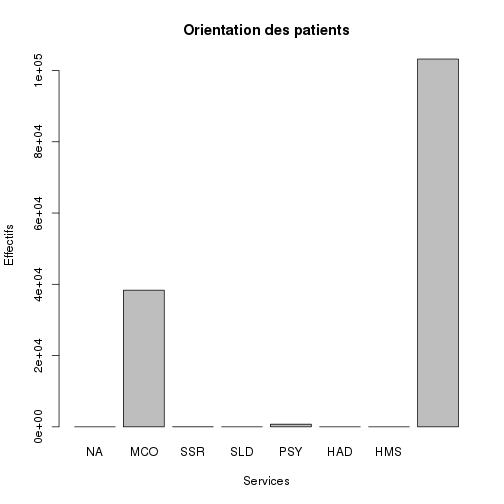
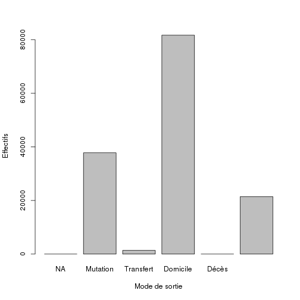

Analyse des RPU 2012 (version linux)
========================================================

Ce document exploite le fichier RData préparé à partir de la table RPU__ de Sagec. Voir le document *RPU2012_Prepa.Rmd* du sossier Resural.

Pour que les légendes de l'axe des Y soient perpendiculaires a ce dernier, rajouter *las = 1*
Pour que les légendes de l'axe des X soient perpendiculaires a ce dernier, rajouter *las = 2*
Pour que les légendes soient perpendiculaires aux 2 axes, rajouter *las = 3*
Par défaut *las = 0*

Initialisation
==============
Définir le working directory:

```r
setwd("~/Documents/Resural/Stat Resural/RPU_2012")
```

```
## Error: impossible de changer de répertoire de travail
```

Mise à jour:

```r
date()
```

```
## [1] "Sat Apr 13 15:43:00 2013"
```

```r
# A NE FAIRE QU'UNE FOIS AU DEBUT DE LA SESSION: loadhistory(file =
# '.Rhistory') timestamp() A FAIRE SI ON CHANGE DE WORKING DIRECTORY
# sauvegarde: savehistory(file = '.Rhistory')
```

Packages nécessaires
--------------------
gdata est utile pour la méthode drop.levels() qui supprime les levels inutiles:
(ref: http://rwiki.sciviews.org/doku.php?id=tips:data-manip:drop_unused_levels)

```r
library("gdata")
```

```
## gdata: read.xls support for 'XLS' (Excel 97-2004) files ENABLED.
```

```
## ```

```
## gdata: read.xls support for 'XLSX' (Excel 2007+) files ENABLED.
```

```
## Attaching package: 'gdata'
```

```
## The following object(s) are masked from 'package:stats':
## 
## nobs
```

```
## The following object(s) are masked from 'package:utils':
## 
## object.size
```

```r
library("rgrs")
library("lubridate")
```


Lecture du fichier des données
---------------------------------------
On lit le fichier de travail créé:

```r
load("rpu2012.Rda")
```

detach(d1)
attach(d1)

Chargement des routines perso
=============================

```r
source("mes_fonctions.R")
```

```
## Warning: impossible d'ouvrir le fichier 'mes_fonctions.R' : Aucun fichier
## ou dossier de ce type
```

```
## Error: impossible d'ouvrir la connexion
```


Analyse des données
===================

```r
n <- dim(d1)
print(n)
```

```
## [1] 142376     20
```

```r
print(names(d1))
```

```
##  [1] "id"            "CODE_POSTAL"   "COMMUNE"       "DESTINATION"  
##  [5] "DP"            "ENTREE"        "EXTRACT"       "FINESS"       
##  [9] "GRAVITE"       "MODE_ENTREE"   "MODE_SORTIE"   "MOTIF"        
## [13] "NAISSANCE"     "ORIENTATION"   "PROVENANCE"    "SEXE"         
## [17] "SORTIE"        "TRANSPORT"     "TRANSPORT_PEC" "AGE"
```

```r
str(d1)
```

```
## 'data.frame':	142376 obs. of  20 variables:
##  $ id           : chr  "2c9d838436119ed90136119ee0280001" "2c9d838436119ed90136119ee0510002" "2c9d838436119ed90136119ee05b0003" "2c9d838436119ed90136119ee0790004" ...
##  $ CODE_POSTAL  : Factor w/ 2150 levels "00000","00109",..: 1331 1228 1228 1202 1211 1181 1181 1258 1257 1263 ...
##  $ COMMUNE      : Factor w/ 4252 levels "0","000000","00000000",..: 1219 3784 3784 4245 1417 3784 3784 2217 3929 1984 ...
##  $ DESTINATION  : Factor w/ 7 levels "NA","MCO","SSR",..: NA NA NA NA NA NA NA 2 2 NA ...
##  $ DP           : chr  NA NA NA NA ...
##  $ ENTREE       : Date, format: "2012-03-12" "2012-03-12" ...
##  $ EXTRACT      : chr  "2012-03-13 23:00:02" "2012-03-13 23:00:02" "2012-03-13 23:00:02" "2012-03-13 23:00:02" ...
##  $ FINESS       : Factor w/ 9 levels "Wis","Sel","Odi",..: 4 4 4 4 4 4 4 4 4 4 ...
##  $ GRAVITE      : Factor w/ 7 levels "1","2","3","4",..: NA NA NA NA NA NA NA NA NA NA ...
##  $ MODE_ENTREE  : Factor w/ 4 levels "NA","Mutation",..: 4 4 4 4 4 4 4 4 4 4 ...
##  $ MODE_SORTIE  : Factor w/ 5 levels "NA","Mutation",..: 4 4 4 4 4 4 4 2 2 4 ...
##  $ MOTIF        : chr  NA NA NA NA ...
##  $ NAISSANCE    : Date, format: "1990-01-29" "1989-10-11" ...
##  $ ORIENTATION  : Factor w/ 13 levels "CHIR","FUGUE",..: NA NA NA NA NA NA NA 13 13 NA ...
##  $ PROVENANCE   : Factor w/ 7 levels "NA","MCO","SSR",..: NA NA NA NA NA NA NA NA NA NA ...
##  $ SEXE         : Factor w/ 3 levels "F","I","M": 1 1 1 1 3 1 1 3 3 1 ...
##  $ SORTIE       : Date, format: "2012-03-13" "2012-03-13" ...
##  $ TRANSPORT    : Factor w/ 6 levels "AMBU","FO","HELI",..: 4 NA 4 NA 4 4 4 NA NA NA ...
##  $ TRANSPORT_PEC: Factor w/ 3 levels "AUCUN","MED",..: 1 1 1 1 1 1 1 1 1 1 ...
##  $ AGE          : num  22 22 40 39 46 52 24 52 59 47 ...
```

```r
summary(d1)
```

```
##       id             CODE_POSTAL            COMMUNE       DESTINATION    
##  Length:142376      68000  :16103   STRASBOURG  :24151   MCO    : 38365  
##  Class :character   67100  : 9616   COLMAR      :16089   PSY    :   745  
##  Mode  :character   67000  : 8453   SELESTAT    : 5329   SSR    :    22  
##                     67600  : 8045   SAINT LOUIS : 2487   SLD    :     9  
##                     67200  : 6100   SCHILTIGHEIM: 2248   HMS    :     3  
##                     68500  : 3407   GUEBWILLER  : 2005   (Other):     1  
##                     (Other):90652   (Other)     :90067   NA's   :103231  
##       DP                ENTREE             EXTRACT         
##  Length:142376      Min.   :2012-01-01   Length:142376     
##  Class :character   1st Qu.:2012-05-30   Class :character  
##  Mode  :character   Median :2012-08-19   Mode  :character  
##                     Mean   :2012-08-09                     
##                     3rd Qu.:2012-10-28                     
##                     Max.   :2012-12-31                     
##                                                            
##      FINESS         GRAVITE         MODE_ENTREE        MODE_SORTIE   
##  Col    :46927   2      :82785   NA       :     0   NA       :    0  
##  Hus    :35889   1      :21081   Mutation :  2515   Mutation :37797  
##  Sel    :26339   3      :13925   Transfert:  2035   Transfert: 1386  
##  Odi    :12354   4      : 1619   Domicile :132743   Domicile :81724  
##  Wis    : 7711   P      : 1325   NA's     :  5083   Décès    :    1  
##  3Fr    : 7342   (Other):  399                      NA's     :21468  
##  (Other): 5814   NA's   :21242                                       
##     MOTIF             NAISSANCE           ORIENTATION       PROVENANCE   
##  Length:142376      Min.   :1883-04-29   UHCD   : 24614   PEA    :90284  
##  Class :character   1st Qu.:1946-12-31   MED    :  8162   MCO    : 4504  
##  Mode  :character   Median :1970-01-21   CHIR   :  4017   PEO    :  895  
##                     Mean   :1967-12-07   REO    :  1334   SSR    :   26  
##                     3rd Qu.:1989-04-20   PSA    :   951   PSY    :   22  
##                     Max.   :2012-12-21   (Other):  1700   (Other):   15  
##                                          NA's   :101598   NA's   :46630  
##  SEXE          SORTIE           TRANSPORT     TRANSPORT_PEC  
##  F:68106   Min.   :2012-01-01   AMBU :21394   AUCUN  :90633  
##  I:    1   1st Qu.:2012-06-01   FO   :  693   MED    : 4779  
##  M:74269   Median :2012-08-21   HELI :   70   PARAMED: 4314  
##            Mean   :2012-08-10   PERSO:67365   NA's   :42650  
##            3rd Qu.:2012-10-28   SMUR : 2097                  
##            Max.   :2013-01-03   VSAB :12182                  
##            NA's   :13755        NA's :38575                  
##       AGE       
##  Min.   :  0.0  
##  1st Qu.: 23.0  
##  Median : 42.0  
##  Mean   : 44.2  
##  3rd Qu.: 65.0  
##  Max.   :105.0  
##  NA's   :2
```

Stuctures hospitalières participantes
=====================================

```r
summary(d1$FINESS)
```

```
##   Wis   Sel   Odi   Hus   Hag   3Fr   Alk   Col   Geb 
##  7711 26339 12354 35889   725  7342   169 46927  4920
```

```r
a <- table(d1$FINESS)
round(prop.table(a) * 100, digits = 2)
```

```
## 
##   Wis   Sel   Odi   Hus   Hag   3Fr   Alk   Col   Geb 
##  5.42 18.50  8.68 25.21  0.51  5.16  0.12 32.96  3.46
```

### Origine temporelle des données:

```r
b <- tapply(d1$ENTREE, d1$FINESS, min)
as.Date(b, origin = "1970-01-01")
```

```
##          Wis          Sel          Odi          Hus          Hag 
## "2012-04-23" "2012-02-17" "2012-06-30" "2012-02-10" "2012-06-18" 
##          3Fr          Alk          Col          Geb 
## "2012-07-09" "2012-11-27" "2012-01-01" "2012-09-01"
```


Exhaustivité des données
------------------------

```r
a <- is.na(d1)
b <- apply(a, 2, mean)
round(b, digits = 2)
```

```
##            id   CODE_POSTAL       COMMUNE   DESTINATION            DP 
##          0.00          0.00          0.00          0.73          0.24 
##        ENTREE       EXTRACT        FINESS       GRAVITE   MODE_ENTREE 
##          0.00          0.00          0.00          0.15          0.04 
##   MODE_SORTIE         MOTIF     NAISSANCE   ORIENTATION    PROVENANCE 
##          0.15          0.34          0.00          0.71          0.33 
##          SEXE        SORTIE     TRANSPORT TRANSPORT_PEC           AGE 
##          0.00          0.10          0.27          0.30          0.00
```


Analyse univariée
=================
Sexe
----

```r
print(summary(d1$SEXE))
```

```
##     F     I     M 
## 68106     1 74269
```

sexratio:

```r
t <- table(d1$SEXE)
print(paste(round(t[1]/t[3], digits = 2), "%"))
```

```
## [1] "0.92 %"
```

Age
---

```r
summary(d1$AGE)
```

```
##    Min. 1st Qu.  Median    Mean 3rd Qu.    Max.    NA's 
##     0.0    23.0    42.0    44.2    65.0   105.0       2
```

```r

age0 <- length(d1[d1$AGE < 1, "AGE"])
age75 <- length(d1[d1$AGE > 75, "AGE"])
age1_75 <- length(d1[d1$AGE > 0 & d1$AGE < 76, "AGE"])
effectif <- c(age0, age1_75, age75)
pourcentage <- round(pop * 100/sum(pop), 2)
```

```
## Error: objet 'pop' introuvable
```

```r
t <- data.frame(effectif, pourcentage, row.names = c("moins de 1 an", "de 1 à 75 ans", 
    "plus de 75 ans"))
```

```
## Error: objet 'pourcentage' introuvable
```

Gravité
-------

```r
table(d1$GRAVITE, useNA = "ifany")
```

```
## 
##     1     2     3     4     5     D     P  <NA> 
## 21081 82785 13925  1619   390     9  1325 21242
```

```r
freq(d1$GRAVITE)
```

```
##        n    %
## 1  21081 14.8
## 2  82785 58.1
## 3  13925  9.8
## 4   1619  1.1
## 5    390  0.3
## D      9  0.0
## P   1325  0.9
## NA 21242 14.9
```

```r
plot(table(d1$GRAVITE, useNA = "ifany"), xlab = "Gravité (CCMU)", ylab = "Effectifs", 
    main = "CCMU")
```

 


Destination
-----------

```r
table(d1$DESTINATION, useNA = "ifany")
```

```
## 
##     NA    MCO    SSR    SLD    PSY    HAD    HMS   <NA> 
##      0  38365     22      9    745      1      3 103231
```

```r
freq(d1$DESTINATION)
```

```
##          n    %
## MCO  38365 26.9
## SSR     22  0.0
## SLD      9  0.0
## PSY    745  0.5
## HAD      1  0.0
## HMS      3  0.0
## NA  103231 72.5
```

```r
plot(table(d1$DESTINATION, useNA = "ifany"), xlab = "Services", ylab = "Effectifs", 
    main = "Orientation des patients")
```

 

FINESS
------

```r
t <- table(d1$FINESS, useNA = "ifany")
t
```

```
## 
##   Wis   Sel   Odi   Hus   Hag   3Fr   Alk   Col   Geb 
##  7711 26339 12354 35889   725  7342   169 46927  4920
```

```r
round(prop.table(t) * 100, 2)
```

```
## 
##   Wis   Sel   Odi   Hus   Hag   3Fr   Alk   Col   Geb 
##  5.42 18.50  8.68 25.21  0.51  5.16  0.12 32.96  3.46
```

```r
freq(d1$FINESS)
```

```
##         n    %
## Wis  7711  5.4
## Sel 26339 18.5
## Odi 12354  8.7
## Hus 35889 25.2
## Hag   725  0.5
## 3Fr  7342  5.2
## Alk   169  0.1
## Col 46927 33.0
## Geb  4920  3.5
## NA      0  0.0
```

```r
plot(table(d1$FINESS, useNA = "ifany"), xlab = "Etablissements", ylab = "Effectifs", 
    main = "Etablissements sièges de SU")
```

 

Mode d'entrée
-------------

```r
table(d1$MODE_ENTREE, useNA = "ifany")
```

```
## 
##        NA  Mutation Transfert  Domicile      <NA> 
##         0      2515      2035    132743      5083
```

```r
freq(d1$MODE_ENTREE)
```

```
##                n    %
## Mutation    2515  1.8
## Transfert   2035  1.4
## Domicile  132743 93.2
## NA          5083  3.6
```

```r
plot(table(d1$MODE_ENTREE, useNA = "ifany"), xlab = "Mode d'entée", ylab = "Effectifs", 
    main = "")
```

 

Mode de sortie
--------------

```r
table(d1$MODE_SORTIE, useNA = "ifany")
```

```
## 
##        NA  Mutation Transfert  Domicile     Décès      <NA> 
##         0     37797      1386     81724         1     21468
```

```r
freq(d1$MODE_SORTIE)
```

```
##               n    %
## Mutation  37797 26.5
## Transfert  1386  1.0
## Domicile  81724 57.4
## Décès         1  0.0
## NA        21468 15.1
```

```r
plot(table(d1$MODE_SORTIE, useNA = "ifany"), xlab = "Mode de sortie", ylab = "Effectifs", 
    main = "")
```

 

Orientation
-----------

```r
table(d1$ORIENTATION, useNA = "ifany")
```

```
## 
##   CHIR  FUGUE    HDT     HO    MED   OBST    PSA    REA    REO     SC 
##   4017    133     88     12   8162     26    951    431   1334    212 
##   SCAM     SI   UHCD   <NA> 
##    215    583  24614 101598
```

```r
freq(d1$ORIENTATION)
```

```
##            n    %
## CHIR    4017  2.8
## FUGUE    133  0.1
## HDT       88  0.1
## HO        12  0.0
## MED     8162  5.7
## OBST      26  0.0
## PSA      951  0.7
## REA      431  0.3
## REO     1334  0.9
## SC       212  0.1
## SCAM     215  0.2
## SI       583  0.4
## UHCD   24614 17.3
## NA    101598 71.4
```

```r
plot(table(d1$ORIENTATION, useNA = "ifany"), xlab = "Orientation", ylab = "Effectifs", 
    main = "")
```

 

Provenance
----------

```r
table(d1$PROVENANCE, useNA = "ifany")
```

```
## 
##    NA   MCO   SSR   SLD   PSY   PEA   PEO  <NA> 
##     0  4504    26    15    22 90284   895 46630
```

```r
freq(d1$PROVENANCE)
```

```
##         n    %
## MCO  4504  3.2
## SSR    26  0.0
## SLD    15  0.0
## PSY    22  0.0
## PEA 90284 63.4
## PEO   895  0.6
## NA  46630 32.8
```

```r
plot(table(d1$PROVENANCE, useNA = "ifany"), xlab = "Provenance", ylab = "Effectifs", 
    main = "")
```

 

Transport
---------

```r
table(d1$TRANSPORT, useNA = "ifany")
```

```
## 
##  AMBU    FO  HELI PERSO  SMUR  VSAB  <NA> 
## 21394   693    70 67365  2097 12182 38575
```

```r
freq(d1$TRANSPORT)
```

```
##           n    %
## AMBU  21394 15.0
## FO      693  0.5
## HELI     70  0.0
## PERSO 67365 47.3
## SMUR   2097  1.5
## VSAB  12182  8.6
## NA    38575 27.1
```

```r
plot(table(d1$TRANSPORT, useNA = "ifany"), xlab = "Mode de transport", ylab = "Effectifs", 
    main = "")
```

 

Prise en charge
---------------

```r
table(d1$TRANSPORT_PEC, useNA = "ifany")
```

```
## 
##   AUCUN     MED PARAMED    <NA> 
##   90633    4779    4314   42650
```

```r
freq(d1$TRANSPORT_PEC)
```

```
##             n    %
## AUCUN   90633 63.7
## MED      4779  3.4
## PARAMED  4314  3.0
## NA      42650 30.0
```

```r
plot(table(d1$TRANSPORT_PEC, useNA = "ifany"), xlab = "Prise en charge pendant le transport", 
    ylab = "Effectifs", main = "")
```

 


Analyse bivariée
================

### Age et sexe

```r
boxplot(d1$AGE ~ d1$SEXE, ylab = "Age (années)", xlab = "Sexe", las = 2)
```

 

Age et Gravité
--------------

```r
boxplot(d1$AGE ~ d1$GRAVITE, xlab = "Gravité exprimée en échelle CCMU", ylab = "Age (années)", 
    main = "Age et Gravité")
```

 

Age et FINESS
-------------
Les HUS ont une patientèle plus agée que la moyenne:       

```r
boxplot(d1$AGE ~ d1$FINESS, xlab = "Etablissement", ylab = "Age (années)")
```

 

```r
round(tapply(d1$AGE, d1$FINESS, mean, na.rm = TRUE), 2)
```

```
##   Wis   Sel   Odi   Hus   Hag   3Fr   Alk   Col   Geb 
## 42.58 37.70 34.04 56.48 44.36 38.99 33.41 43.09 36.46
```

Age et établissement
--------------------

```r
boxplot(d1$AGE ~ d1$FINESS, ylab = "Age (années)", xlab = "Etablissement", 
    main = "Age des patients selon l'établissement")
```

 

FINESS
======
### FINESS et GRAVITE

```r
plot(d1$FINESS ~ d1$GRAVITE, ylab = "Etablissement", xlab = "Gravité (CCMU)")
```

 

```r
a <- table(d1$FINESS, d1$GRAVITE)
addmargins(a)
```

```
##      
##            1      2      3      4      5      D      P    Sum
##   Wis    644   6619    345     59     22      1     15   7705
##   Sel   2762  17781   4414    556     55      1    147  25716
##   Odi    668  11503    110      3      1      1      1  12287
##   Hus   2848   8676   3517    621    108      0      1  15771
##   Hag    103    461     88      8      4      0      0    664
##   3Fr    905   6212     74      0      1      0      1   7193
##   Alk     22    107     12      5      2      0      0    148
##   Col  12947  26727   5355    363    197      4   1147  46740
##   Geb    182   4699     10      4      0      2     13   4910
##   Sum  21081  82785  13925   1619    390      9   1325 121134
```

```r
round(prop.table(a) * 100, digit = 2)
```

```
##      
##           1     2     3     4     5     D     P
##   Wis  0.53  5.46  0.28  0.05  0.02  0.00  0.01
##   Sel  2.28 14.68  3.64  0.46  0.05  0.00  0.12
##   Odi  0.55  9.50  0.09  0.00  0.00  0.00  0.00
##   Hus  2.35  7.16  2.90  0.51  0.09  0.00  0.00
##   Hag  0.09  0.38  0.07  0.01  0.00  0.00  0.00
##   3Fr  0.75  5.13  0.06  0.00  0.00  0.00  0.00
##   Alk  0.02  0.09  0.01  0.00  0.00  0.00  0.00
##   Col 10.69 22.06  4.42  0.30  0.16  0.00  0.95
##   Geb  0.15  3.88  0.01  0.00  0.00  0.00  0.01
```

Gavité et établissement: les fréquences sont exprimées en pourcentage. La somme de chaque ligne est égale à 100%.

```r
addmargins(round(prop.table(a, margin = 1) * 100, digit = 2), margin = 2)
```

```
##      
##            1      2      3      4      5      D      P    Sum
##   Wis   8.36  85.91   4.48   0.77   0.29   0.01   0.19 100.01
##   Sel  10.74  69.14  17.16   2.16   0.21   0.00   0.57  99.98
##   Odi   5.44  93.62   0.90   0.02   0.01   0.01   0.01 100.01
##   Hus  18.06  55.01  22.30   3.94   0.68   0.00   0.01 100.00
##   Hag  15.51  69.43  13.25   1.20   0.60   0.00   0.00  99.99
##   3Fr  12.58  86.36   1.03   0.00   0.01   0.00   0.01  99.99
##   Alk  14.86  72.30   8.11   3.38   1.35   0.00   0.00 100.00
##   Col  27.70  57.18  11.46   0.78   0.42   0.01   2.45 100.00
##   Geb   3.71  95.70   0.20   0.08   0.00   0.04   0.26  99.99
```

Avec code de couleur:

```r
plot(d1$FINESS ~ d1$GRAVITE, ylab = "Etablissement", xlab = "Gravité (CCMU)", 
    col = terrain.colors(n = 9))
```

 

Même calcul en supprimant Hag et Alk dont la contribution est négligeable:
(nécessite le package gdata)

```r
d2 <- d1[d1$FINESS != "Hag" & d1$FINESS != "Alk", c(8, 9)]
d2$FINESS <- drop.levels(d2$FINESS)
```

```
## Warning: NAs introduits lors de la conversion automatique
```

```
## Warning: NAs introduits lors de la conversion automatique
```

```
## Warning: NAs introduits lors de la conversion automatique
```

```
## Warning: NAs introduits lors de la conversion automatique
```

```
## Warning: NAs introduits lors de la conversion automatique
```

```
## Warning: NAs introduits lors de la conversion automatique
```

```
## Warning: NAs introduits lors de la conversion automatique
```

```
## Warning: NAs introduits lors de la conversion automatique
```

```
## Warning: NAs introduits lors de la conversion automatique
```

```
## Warning: NAs introduits lors de la conversion automatique
```

```
## Warning: NAs introduits lors de la conversion automatique
```

```
## Warning: NAs introduits lors de la conversion automatique
```

```
## Warning: NAs introduits lors de la conversion automatique
```

```
## Warning: NAs introduits lors de la conversion automatique
```

```r
summary(d2$FINESS)
```

```
##   3Fr   Col   Geb   Hus   Odi   Sel   Wis 
##  7342 46927  4920 35889 12354 26339  7711
```

```r
plot(d2$FINESS ~ d2$GRAVITE, ylab = "Etablissement", xlab = "Gravité (CCMU)", 
    col = terrain.colors(n = 7))
```

 

