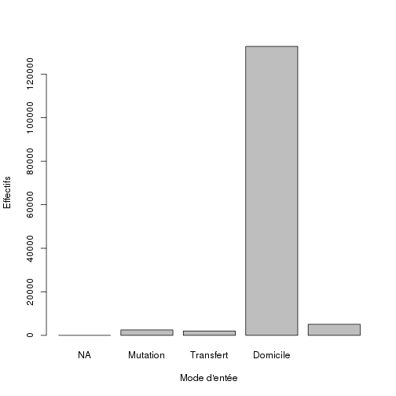

Analyse des RPU 2012 (version linux)
========================================================

```r
date()
```

```
## [1] "Sat May 11 23:39:09 2013"
```

source: RPU2012GIT/RPU2012

GIT: jcrb & Vendenheim1

Ce document exploite le fichier RData préparé à partir de la table RPU__ de Sagec. Voir le document *RPU2012_Prepa.Rmd* du sossier Resural.

Pour que les légendes de l'axe des Y soient perpendiculaires a ce dernier, rajouter *las = 1*
Pour que les légendes de l'axe des X soient perpendiculaires a ce dernier, rajouter *las = 2*
Pour que les légendes soient perpendiculaires aux 2 axes, rajouter *las = 3*
Par défaut *las = 0*

L'utilisation de la méthode *SweaveInput* provoque un erreur si le fichier à inclure comporte des caractères accenués (même enregistrés en UTF8)

Création d'un tableau avec *cbind* et une matrice (et xtable pour pdf): voir exhaustivité des données

Initialisation
==============
Définir le working directory:

```r
setwd("~/Documents/Resural/Stat Resural/RPU2012GIT/RPU2012")
```

Mise à jour:

```r
date()
```

```
## [1] "Sat May 11 23:39:09 2013"
```

```r
# A NE FAIRE QU'UNE FOIS AU DEBUT DE LA SESSION: loadhistory(file =
# '.Rhistory') timestamp() A FAIRE SI ON CHANGE DE WORKING DIRECTORY
# sauvegarde: savehistory(file = '.Rhistory')
```

Packages nécessaires
--------------------
gdata est utile pour la méthode drop.levels() qui supprime les levels inutiles:
(ref: http://rwiki.sciviews.org/doku.php?id=tips:data-manip:drop_unused_levels)

note: pour supprimer les messages inutiles *{r message=FALSE}*

note: pour supprimer les warnings: *{r warning=FALSE}*

```r
library("gdata")
library("rgrs")
library("lubridate")
library("epicalc")
```


Lecture du fichier des données
---------------------------------------
On lit le fichier de travail créé:

```r
getwd()
```

```
## [1] "/home/jcb/Documents/Resural/Stat Resural/RPU2012GIT/RPU2012"
```

```r
# Détache et supprime tous les objets et données de l'environnement
# global:
zap()
load("rpu2012.Rda")
attach(d1)
use(d1)
```


Chargement des routines perso
-----------------------------

```r
source("mes_fonctions.R")
```


Analyse des données
===================

```r
n <- dim(d1)
print(n)
```

```
## [1] 142376     20
```

```r
print(names(d1))
```

```
##  [1] "id"            "CODE_POSTAL"   "COMMUNE"       "DESTINATION"  
##  [5] "DP"            "ENTREE"        "EXTRACT"       "FINESS"       
##  [9] "GRAVITE"       "MODE_ENTREE"   "MODE_SORTIE"   "MOTIF"        
## [13] "NAISSANCE"     "ORIENTATION"   "PROVENANCE"    "SEXE"         
## [17] "SORTIE"        "TRANSPORT"     "TRANSPORT_PEC" "AGE"
```

```r
str(d1)
```

```
## 'data.frame':	142376 obs. of  20 variables:
##  $ id           : Factor w/ 150493 levels "2c9d838436119ed90136119ee0280001",..: 1 2 3 4 5 6 7 8 9 10 ...
##  $ CODE_POSTAL  : Factor w/ 2216 levels "0","109","110",..: 1379 1276 1276 1250 1259 1229 1229 1306 1305 1311 ...
##  $ COMMUNE      : Factor w/ 4377 levels "0","000000","00000000",..: 1260 3895 3895 4370 1464 3895 3895 2283 4043 2046 ...
##  $ DESTINATION  : Factor w/ 7 levels "NA","MCO","SSR",..: NA NA NA NA NA NA NA 2 2 NA ...
##  $ DP           : Factor w/ 5973 levels "A020","A029",..: 3742 3742 3742 3742 3742 3742 3742 3742 3742 3742 ...
##  $ ENTREE       : Factor w/ 126394 levels "2011-12-24 00:15:00",..: 10509 10463 10493 9287 9606 9607 10397 9567 9377 10049 ...
##  $ EXTRACT      : Factor w/ 1533 levels "2012-01-01 06:03:51",..: 65 65 65 65 65 65 65 65 65 65 ...
##  $ FINESS       : Factor w/ 9 levels "Wis","Sel","Odi",..: 4 4 4 4 4 4 4 4 4 4 ...
##  $ GRAVITE      : Factor w/ 8 levels "1","2","3","4",..: 7 7 7 7 7 7 7 7 7 7 ...
##  $ MODE_ENTREE  : Factor w/ 4 levels "NA","Mutation",..: 4 4 4 4 4 4 4 4 4 4 ...
##  $ MODE_SORTIE  : Factor w/ 5 levels "NA","Mutation",..: 4 4 4 4 4 4 4 2 2 4 ...
##  $ MOTIF        : Factor w/ 22220 levels "0 ; une agression",..: 5539 5539 5539 5539 5539 5539 5539 5539 5539 5539 ...
##  $ NAISSANCE    : Date, format: "1990-01-29" "1989-10-11" ...
##  $ ORIENTATION  : Factor w/ 52 levels "2012-05-18 22:31:00",..: 43 43 43 43 43 43 43 52 52 43 ...
##  $ PROVENANCE   : Factor w/ 7 levels "NA","MCO","SSR",..: NA NA NA NA NA NA NA NA NA NA ...
##  $ SEXE         : Factor w/ 7 levels "","AUCUN","F",..: 3 3 3 3 5 3 3 5 5 3 ...
##  $ SORTIE       : Factor w/ 108919 levels "","2011-12-24 01:21:00",..: 9281 9256 9271 8241 8511 8512 9222 8322 8161 8908 ...
##  $ TRANSPORT    : Factor w/ 8 levels "","AMBU","FO",..: 6 5 6 5 6 6 6 5 5 5 ...
##  $ TRANSPORT_PEC: Factor w/ 5 levels "","AUCUN","MED",..: 2 2 2 2 2 2 2 2 2 2 ...
##  $ AGE          : num  22 22 40 39 46 52 24 52 59 47 ...
```

```r
summary(d1)
```

```
##                                 id          CODE_POSTAL   
##  2c9d838436119ed90136119ee0280001:     1   68000  :16103  
##  2c9d838436119ed90136119ee0510002:     1   67100  : 9616  
##  2c9d838436119ed90136119ee05b0003:     1   67000  : 8453  
##  2c9d838436119ed90136119ee0790004:     1   67600  : 8045  
##  2c9d838436119ed90136119ee0860005:     1   67200  : 6100  
##  2c9d838436119ed90136119ee08d0006:     1   68500  : 3407  
##  (Other)                         :142370   (Other):90652  
##          COMMUNE       DESTINATION           DP        
##  STRASBOURG  :24151   MCO    : 38365   NULL   : 33827  
##  COLMAR      :16089   PSY    :   745   S934   :  2032  
##  SELESTAT    : 5329   SSR    :    22   R104   :  1428  
##  SAINT LOUIS : 2487   SLD    :     9   R53+1  :  1210  
##  SCHILTIGHEIM: 2248   HMS    :     3   S610   :  1030  
##  GUEBWILLER  : 2005   (Other):     1   N23    :  1007  
##  (Other)     :90067   NA's   :103231   (Other):101842  
##                  ENTREE                      EXTRACT           FINESS     
##  2012-11-20 13:54:00:     6   2012-04-09 06:06:57:  1083   Col    :46927  
##  2012-04-25 16:37:00:     5   2012-05-04 06:04:55:  1081   Hus    :35889  
##  2012-04-28 15:49:00:     5   2012-04-24 06:02:32:  1061   Sel    :26339  
##  2012-06-16 15:12:00:     5   2012-01-29 06:09:59:   988   Odi    :12354  
##  2012-06-22 19:09:00:     5   2012-05-15 06:05:02:   862   Wis    : 7711  
##  2012-07-14 21:10:00:     5   2012-01-08 06:05:28:   860   3Fr    : 7342  
##  (Other)            :142345   (Other)            :136441   (Other): 5814  
##     GRAVITE         MODE_ENTREE        MODE_SORTIE           MOTIF      
##  2      :82785   NA       :     0   NA       :    0   NULL      :48492  
##  NULL   :21242   Mutation :  2515   Mutation :37797   TRAUMATO17: 6949  
##  1      :21081   Transfert:  2035   Transfert: 1386   T139      : 2972  
##  3      :13925   Domicile :132743   Domicile :81724   GASTRO04  : 2188  
##  4      : 1619   NA's     :  5083   Décès    :    1   TRAUMATO09: 2164  
##  P      : 1325                      NA's     :21468   T119      : 2084  
##  (Other):  399                                        (Other)   :77527  
##    NAISSANCE           ORIENTATION       PROVENANCE       SEXE      
##  Min.   :1883-04-29   NULL   :101576   PEA    :90248        :   31  
##  1st Qu.:1946-12-31   UHCD   : 24605   MCO    : 4504   AUCUN:    3  
##  Median :1970-01-21   MED    :  8162   PEO    :  895   F    :68089  
##  Mean   :1967-12-06   CHIR   :  4017   SSR    :   26   I    :    1  
##  3rd Qu.:1989-04-20   REO    :  1332   PSY    :   22   M    :74250  
##  Max.   :2012-12-21   PSA    :   948   (Other):   15   NULL :    1  
##  NA's   :36           (Other):  1736   NA's   :46666   PERSO:    1  
##                  SORTIE         TRANSPORT     TRANSPORT_PEC  
##  NULL               : 13755   PERSO  :67336          :   36  
##                     :    35   NULL   :38574   AUCUN  :90600  
##  2012-04-30 20:59:00:    12   AMBU   :21393   MED    : 4777  
##  2012-12-07 20:00:00:    11   VSAB   :12179   NULL   :42649  
##  2012-04-29 20:24:00:     8   SMUR   : 2095   PARAMED: 4314  
##  2012-05-01 00:46:00:     8   FO     :  693                  
##  (Other)            :128547   (Other):  106                  
##       AGE       
##  Min.   :  0.0  
##  1st Qu.: 23.0  
##  Median : 42.0  
##  Mean   : 44.2  
##  3rd Qu.: 65.0  
##  Max.   :129.0  
##  NA's   :36
```

```r

des()
```

```
##  
##  No. of observations =  142376 
##    Variable      Class           Description
## 1  id            factor                     
## 2  CODE_POSTAL   factor                     
## 3  COMMUNE       factor                     
## 4  DESTINATION   factor                     
## 5  DP            factor                     
## 6  ENTREE        factor                     
## 7  EXTRACT       factor                     
## 8  FINESS        factor                     
## 9  GRAVITE       factor                     
## 10 MODE_ENTREE   factor                     
## 11 MODE_SORTIE   factor                     
## 12 MOTIF         factor                     
## 13 NAISSANCE     Date                       
## 14 ORIENTATION   factor                     
## 15 PROVENANCE    factor                     
## 16 SEXE          factor                     
## 17 SORTIE        factor                     
## 18 TRANSPORT     factor                     
## 19 TRANSPORT_PEC factor                     
## 20 AGE           numeric
```

```r
summ()
```

```
## 
## 
## No. of observations = 142376
## 
##    Var. name     obs.   mean       median     s.d.      min.      
## 1  id            142376 72046.678  72163.5    41279.83  1         
## 2  CODE_POSTAL   142376 1343.642   1338       162.96    1         
## 3  COMMUNE       142376 2668.957   2870       1158.155  1         
## 4  DESTINATION   39145  2.059      2          0.414     2         
## 5  DP            142376 3562.376   3742       1306.631  1         
## 6  ENTREE        142376 62310.854  62923.5    34302.914 972       
## 7  EXTRACT       142376 673.041    641        439.87    2         
## 8  FINESS        142376 4.984      4          2.59      1         
## 9  GRAVITE       142376 2.783      2          1.941     1         
## 10 MODE_ENTREE   137293 3.949      4          0.292     2         
## 11 MODE_SORTIE   120908 3.363      4          0.926     2         
## 12 MOTIF         142376 8079.444   5625       5032.977  1         
## 13 NAISSANCE     142340 1967-12-06 1970-01-21 <NA>      1883-04-29
## 14 ORIENTATION   142376 44.399     43         3.779     1         
## 15 PROVENANCE    95710  5.82       6          0.856     2         
## 16 SEXE          142376 4.043      5          1         1         
## 17 SORTIE        142376 58852.411  59508.5    32544.131 1         
## 18 TRANSPORT     142376 5.297      6          1.609     1         
## 19 TRANSPORT_PEC 142376 2.723      2          0.991     1         
## 20 AGE           142340 44.21      42         25.91     0         
##    max.      
## 1  145172    
## 2  2216      
## 3  4377      
## 4  7         
## 5  5973      
## 6  120663    
## 7  1479      
## 8  9         
## 9  8         
## 10 4         
## 11 5         
## 12 22220     
## 13 2012-12-21
## 14 52        
## 15 7         
## 16 7         
## 17 108919    
## 18 8         
## 19 5         
## 20 129
```

Stuctures hospitalières participantes
=====================================

```r
unique(FINESS)
```

```
## [1] Hus Sel Col Wis Hag Odi 3Fr Geb Alk
## Levels: Wis Sel Odi Hus Hag 3Fr Alk Col Geb
```

```r
summary(d1$FINESS)
```

```
##   Wis   Sel   Odi   Hus   Hag   3Fr   Alk   Col   Geb 
##  7711 26339 12354 35889   725  7342   169 46927  4920
```

```r
a <- table(d1$FINESS)
round(prop.table(a) * 100, digits = 2)
```

```
## 
##   Wis   Sel   Odi   Hus   Hag   3Fr   Alk   Col   Geb 
##  5.42 18.50  8.68 25.21  0.51  5.16  0.12 32.96  3.46
```

### Origine temporelle des données:

```r
b <- tapply(as.Date(d1$ENTREE), d1$FINESS, min)
c <- as.Date(b, origin = "1970-01-01")
cbind(as.character(sort(c)))
```

```
##     [,1]        
## Col "2012-01-01"
## Hus "2012-02-10"
## Sel "2012-02-17"
## Wis "2012-04-23"
## Hag "2012-06-18"
## Odi "2012-06-30"
## 3Fr "2012-07-09"
## Geb "2012-09-01"
## Alk "2012-11-27"
```


Exhaustivité des données
------------------------
Il faut tranformer les valeurs NULL en NA pour pouvoir les comptabiliser. Les valeurs NULL apparaissent pour les factors: DP, MOTIF, TRANSPORT, ORIENTATION,GRAVITE, SORTIE. Il faut les transformer en charecter pour leur attriber la valeur NA au lieu de NULL:

```r
a <- as.character(d1$DP)
a[a == "NULL"] <- NA
sum(is.na(a))
```

```
## [1] 33827
```

```r
mean(is.na(a))
```

```
## [1] 0.2376
```

sum(is.na(a)) retourne le nombre de lignes concernées et *mean(is.na(a))* donne directement le pourcentage de valeurs nulles (R in action pp 356)

```r
d1$DP <- a

a <- as.character(d1$MOTIF)
a[a == "NULL"] <- NA
d1$MOTIF <- a

a <- as.character(d1$TRANSPORT)
a[a == "NULL"] <- NA
d1$TRANSPORT <- a

a <- as.character(d1$ORIENTATION)
a[a == "NULL"] <- NA
d1$ORIENTATION <- a

a <- as.character(d1$GRAVITE)
a[a == "NULL"] <- NA
d1$GRAVITE <- a

a <- as.character(d1$SORTIE)
a[a == "NULL"] <- NA
d1$SORTIE <- a

a <- as.character(d1$ENTREE)
a[a == "NULL"] <- NA
d1$ENTREE <- a
```


```r
a <- is.na(d1)
b <- apply(a, 2, mean)
a <- cbind(sort(round(b * 100, 2)))
colnames(a) <- "%"
a
```

```
##                   %
## id             0.00
## CODE_POSTAL    0.00
## COMMUNE        0.00
## ENTREE         0.00
## EXTRACT        0.00
## FINESS         0.00
## SEXE           0.00
## TRANSPORT_PEC  0.00
## NAISSANCE      0.03
## AGE            0.03
## MODE_ENTREE    3.57
## SORTIE         9.66
## GRAVITE       14.92
## MODE_SORTIE   15.08
## DP            23.76
## TRANSPORT     27.09
## PROVENANCE    32.78
## MOTIF         34.06
## ORIENTATION   71.34
## DESTINATION   72.51
```

# xtable(a)

orientation -> données erronées


Analyse univariée
=================
Sexe
----

```r
print(summary(d1$SEXE))
```

```
##       AUCUN     F     I     M  NULL PERSO 
##    31     3 68089     1 74250     1     1
```

Dossiers où la variable SEXE a une valeur aberrante:

```r
a <- d1[d1$SEXE != "F" & d1$SEXE != "M", ]
nrow(a)
```

```
## [1] 37
```

Finess concernés:

```r
a[, "FINESS"]
```

```
##  [1] Col Col Col Col Col Col Col Col Col Col Col Col Col Col Col Col Col
## [18] Col Col Col Col Col Col Col Col Col Col Col Sel Col Col Col Col Col
## [35] Col Col Col
## Levels: Wis Sel Odi Hus Hag 3Fr Alk Col Geb
```

Note: toutes les valeurs qui ne sont ni F ou M sont transformées en NA. Puis on applique une astuce qui consiste à réappliquer *factor* au vecteur (nb: d1$SEXE est du type factor). On peut aussi utiliser *drop.levels()* from the gdata package. Source: http://www.r-bloggers.com/r-drop-factor-levels-in-a-dataset

```r
a <- d1$SEXE
summary(a)
```

```
##       AUCUN     F     I     M  NULL PERSO 
##    31     3 68089     1 74250     1     1
```

```r
a[a != "F" & a != "M"] <- NA
a <- factor(a)
summary(a)
```

```
##     F     M  NA's 
## 68089 74250    37
```

```r
boxplot(d1$AGE ~ a, col = "yellow")
```

 

```r
d1$SEXE <- a
```


sexratio:

```r
t <- table(d1$SEXE)
print(paste(round(t["M"]/t["F"], digits = 2), "%"))
```

```
## [1] "1.09 %"
```

Age
---

```r
summary(d1$AGE)
```

```
##    Min. 1st Qu.  Median    Mean 3rd Qu.    Max.    NA's 
##     0.0    23.0    42.0    44.2    65.0   129.0      36
```

```r

age0 <- length(d1[d1$AGE < 1, "AGE"])
age75 <- length(d1[d1$AGE > 75, "AGE"])
age1_75 <- length(d1[d1$AGE > 0 & d1$AGE < 76, "AGE"])
effectif <- c(age0, age1_75, age75)
pourcentage <- round(pop * 100/sum(pop), 2)
```

```
## Error: objet 'pop' introuvable
```

```r
t <- data.frame(effectif, pourcentage, row.names = c("moins de 1 an", "de 1 à 75 ans", 
    "plus de 75 ans"))
```

```
## Error: objet 'pourcentage' introuvable
```

Gravité
-------

```r
table(d1$GRAVITE, useNA = "ifany")
```

```
## 
##     1     2     3     4     5     D     P  <NA> 
## 21081 82785 13925  1619   390     9  1325 21242
```

```r
freq(d1$GRAVITE)
```

```
##        n    %
## 1  21081 14.8
## 2  82785 58.1
## 3  13925  9.8
## 4   1619  1.1
## 5    390  0.3
## D      9  0.0
## P   1325  0.9
## NA 21242 14.9
```

```r
barplot(table(d1$GRAVITE, useNA = "ifany"), xlab = "Gravité (CCMU)", ylab = "Effectifs", 
    main = "CCMU")
```

 

### gravité et sexe
en valeur absolue:

```r
t <- table(d1$GRAVITE, d1$SEXE)
round(prop.table(t) * 100, 3)
```

```
##    
##          F      M
##   1  8.119  9.274
##   2 32.579 35.773
##   3  5.639  5.857
##   4  0.661  0.675
##   5  0.135  0.187
##   D  0.002  0.006
##   P  0.576  0.516
```

en pourcentage:

```r
addmargins(t)
```

```
##      
##            F      M    Sum
##   1     9832  11230  21062
##   2    39452  43320  82772
##   3     6829   7093  13922
##   4      801    818   1619
##   5      163    227    390
##   D        2      7      9
##   P      698    625   1323
##   Sum  57777  63320 121097
```

```r
round(addmargins(prop.table(t) * 100), 3)
```

```
##      
##             F       M     Sum
##   1     8.119   9.274  17.393
##   2    32.579  35.773  68.352
##   3     5.639   5.857  11.497
##   4     0.661   0.675   1.337
##   5     0.135   0.187   0.322
##   D     0.002   0.006   0.007
##   P     0.576   0.516   1.093
##   Sum  47.711  52.289 100.000
```


### gravité et age
Moyenne et ecart-type:

```r
round(tapply(d1$AGE, d1$GRAVITE, mean, na.rm = TRUE), 2)
```

```
##     1     2     3     4     5     D     P 
## 36.77 41.07 56.48 66.94 63.62 69.33 41.93
```

```r
round(tapply(d1$AGE, d1$GRAVITE, sd, na.rm = TRUE), 2)
```

```
##     1     2     3     4     5     D     P 
## 24.69 25.18 27.16 21.70 19.99 25.94 16.72
```

```r
boxplot(d1$AGE ~ d1$GRAVITE, xlab = "Gravité (CCMU)", ylab = "Age (années)", 
    main = "CCMU et Age", col = "green")
```

 


### gravité et Finess

```r
t <- table(d1$FINESS, d1$GRAVITE)
t
```

```
##      
##           1     2     3     4     5     D     P
##   Wis   644  6619   345    59    22     1    15
##   Sel  2762 17781  4414   556    55     1   147
##   Odi   668 11503   110     3     1     1     1
##   Hus  2848  8676  3517   621   108     0     1
##   Hag   103   461    88     8     4     0     0
##   3Fr   905  6212    74     0     1     0     1
##   Alk    22   107    12     5     2     0     0
##   Col 12947 26727  5355   363   197     4  1147
##   Geb   182  4699    10     4     0     2    13
```

```r
a <- round(prop.table(t) * 100, 3)
a
```

```
##      
##            1      2      3      4      5      D      P
##   Wis  0.532  5.464  0.285  0.049  0.018  0.001  0.012
##   Sel  2.280 14.679  3.644  0.459  0.045  0.001  0.121
##   Odi  0.551  9.496  0.091  0.002  0.001  0.001  0.001
##   Hus  2.351  7.162  2.903  0.513  0.089  0.000  0.001
##   Hag  0.085  0.381  0.073  0.007  0.003  0.000  0.000
##   3Fr  0.747  5.128  0.061  0.000  0.001  0.000  0.001
##   Alk  0.018  0.088  0.010  0.004  0.002  0.000  0.000
##   Col 10.688 22.064  4.421  0.300  0.163  0.003  0.947
##   Geb  0.150  3.879  0.008  0.003  0.000  0.002  0.011
```

```r
barplot(a[, 1], main = "Pourcentage de CCMU 1 selon le SU", xlab = "Service d'urgence", 
    ylab = "CCMU 1 (en % de l'ensemble des CCMU)")
```

 

```r
barplot(a[, 2], main = "Pourcentage de CCMU 2 selon le SU", xlab = "Service d'urgence", 
    ylab = "CCMU 2 (en % de l'ensemble des CCMU)")
```

 

```r
barplot(a[, 3], main = "Pourcentage de CCMU 3 selon le SU", xlab = "Service d'urgence", 
    ylab = "CCMU 3 (en % de l'ensemble des CCMU)")
```

 

```r
barplot(a[, 4], main = "Pourcentage de CCMU 4 selon le SU", xlab = "Service d'urgence", 
    ylab = "CCMU 4 (en % de l'ensemble des CCMU)")
```

 

```r
barplot(a[, 5], main = "Pourcentage de CCMU 5 selon le SU", xlab = "Service d'urgence", 
    ylab = "CCMU 5 (en % de l'ensemble des CCMU)")
```

 

```r
barplot(a[, 6], main = "Pourcentage de CCMU D selon le SU", xlab = "Service d'urgence", 
    ylab = "CCMU D (en % de l'ensemble des CCMU)")
```

 

```r
barplot(a[, 7], main = "Pourcentage de CCMU P selon le SU", xlab = "Service d'urgence", 
    ylab = "CCMU P (en % de l'ensemble des CCMU)")
```

 

```r
round(addmargins(prop.table(t) * 100), 3)
```

```
##      
##             1       2       3       4       5       D       P     Sum
##   Wis   0.532   5.464   0.285   0.049   0.018   0.001   0.012   6.361
##   Sel   2.280  14.679   3.644   0.459   0.045   0.001   0.121  21.229
##   Odi   0.551   9.496   0.091   0.002   0.001   0.001   0.001  10.143
##   Hus   2.351   7.162   2.903   0.513   0.089   0.000   0.001  13.019
##   Hag   0.085   0.381   0.073   0.007   0.003   0.000   0.000   0.548
##   3Fr   0.747   5.128   0.061   0.000   0.001   0.000   0.001   5.938
##   Alk   0.018   0.088   0.010   0.004   0.002   0.000   0.000   0.122
##   Col  10.688  22.064   4.421   0.300   0.163   0.003   0.947  38.585
##   Geb   0.150   3.879   0.008   0.003   0.000   0.002   0.011   4.053
##   Sum  17.403  68.342  11.496   1.337   0.322   0.007   1.094 100.000
```


Destination
-----------

```r
table(d1$DESTINATION, useNA = "ifany")
```

```
## 
##     NA    MCO    SSR    SLD    PSY    HAD    HMS   <NA> 
##      0  38365     22      9    745      1      3 103231
```

```r
freq(d1$DESTINATION)
```

```
##          n    %
## MCO  38365 26.9
## SSR     22  0.0
## SLD      9  0.0
## PSY    745  0.5
## HAD      1  0.0
## HMS      3  0.0
## NA  103231 72.5
```

```r
barplot(table(d1$DESTINATION, useNA = "ifany"), xlab = "Services", ylab = "Effectifs", 
    main = "Orientation des patients")
```

 

FINESS
------

```r
t <- table(d1$FINESS, useNA = "ifany")
t
```

```
## 
##   Wis   Sel   Odi   Hus   Hag   3Fr   Alk   Col   Geb 
##  7711 26339 12354 35889   725  7342   169 46927  4920
```

```r
round(prop.table(t) * 100, 2)
```

```
## 
##   Wis   Sel   Odi   Hus   Hag   3Fr   Alk   Col   Geb 
##  5.42 18.50  8.68 25.21  0.51  5.16  0.12 32.96  3.46
```

```r
freq(d1$FINESS)
```

```
##         n    %
## Wis  7711  5.4
## Sel 26339 18.5
## Odi 12354  8.7
## Hus 35889 25.2
## Hag   725  0.5
## 3Fr  7342  5.2
## Alk   169  0.1
## Col 46927 33.0
## Geb  4920  3.5
## NA      0  0.0
```

```r
barplot(table(d1$FINESS, useNA = "ifany"), xlab = "Etablissements", ylab = "Effectifs", 
    main = "Etablissements sièges de SU")
```

 

Mode d'entrée
-------------

```r
table(d1$MODE_ENTREE, useNA = "ifany")
```

```
## 
##        NA  Mutation Transfert  Domicile      <NA> 
##         0      2515      2035    132743      5083
```

```r
freq(d1$MODE_ENTREE)
```

```
##                n    %
## Mutation    2515  1.8
## Transfert   2035  1.4
## Domicile  132743 93.2
## NA          5083  3.6
```

```r
barplot(table(d1$MODE_ENTREE, useNA = "ifany"), xlab = "Mode d'entée", ylab = "Effectifs", 
    main = "")
```

 

Mode de sortie
--------------

```r
table(d1$MODE_SORTIE, useNA = "ifany")
```

```
## 
##        NA  Mutation Transfert  Domicile     Décès      <NA> 
##         0     37797      1386     81724         1     21468
```

```r
freq(d1$MODE_SORTIE)
```

```
##               n    %
## Mutation  37797 26.5
## Transfert  1386  1.0
## Domicile  81724 57.4
## Décès         1  0.0
## NA        21468 15.1
```

```r
barplot(table(d1$MODE_SORTIE, useNA = "ifany"), xlab = "Mode de sortie", ylab = "Effectifs", 
    main = "")
```

 

Orientation
-----------
La rubrique *ORIENTATION* comporte un certain nombre d'éléments aberrants qui perturbent son interprétation comme facteur. Dans un premier temps, on ne retient que les valeurs comportant moins de dix caractères, puis on transforme la rubrique en facteur:

```r
b <- d1$ORIENTATION[nchar(d1$ORIENTATION) < 10]
d1$ORIENTATION <- as.factor(b)
```

```
## Error: replacement has 142344 rows, data has 142376
```

La ligne précédente génére une erreur car *b* comporte moins de lignes que *d1* puisqu'on a retiré les éléments comportants plus de 10 caractères.

Il reste encore quelques intitulés anormaux: M, F, REO?

On suppose également que les *NA* correspondent aux patients non hospitalisés. On crée un dataframe des patients hospitalisés après leur passage aux urgences

```r
a <- b[!is.na(b)]
```

nombre de patients hospitalisés:

```r
length(a)
```

```
## [1] 40768
```

Taux d'hospitalisation:

```r
round(length(a) * 100/nrow(d1), 2)
```

```
## [1] 28.63
```


Transformation en facteur et analyse:

```r
hospit <- factor(a)
hospit[hospit == "M" | hospit == "F"] <- NA  # on supprime M et F
summary(hospit)
```

```
##  CHIR     F FUGUE   HDT    HO     M   MED  OBST   PSA   REA   REO    SC 
##  4017     0   133    88    12     0  8162    26   948   431  1332   212 
##  SCAM    SI  UHCD  NA's 
##   215   583 24605     4
```

```r
f <- freq(hospit, sort = "inc", digits = 2)
f
```

```
##           n     %
## NA        4  0.01
## HO       12  0.03
## OBST     26  0.06
## HDT      88  0.22
## FUGUE   133  0.33
## SC      212  0.52
## SCAM    215  0.53
## REA     431  1.06
## SI      583  1.43
## PSA     948  2.33
## REO    1332  3.27
## CHIR   4017  9.85
## MED    8162 20.02
## UHCD  24605 60.35
```

```r
t <- table(hospit)
sort(t)
```

```
## hospit
##     F     M    HO  OBST   HDT FUGUE    SC  SCAM   REA    SI   PSA   REO 
##     0     0    12    26    88   133   212   215   431   583   948  1332 
##  CHIR   MED  UHCD 
##  4017  8162 24605
```

```r
barplot(sort(t, decreasing = TRUE), main = "Orientation des patients hospitalisés")
```

 

on forme deux nouveaux dataframe qui ne prennent pas en compte les lignes anormales et ne retiennent que les patients hospitalisés (*hop*) ou non hospitalisés (*nonhop*):

```r
hop <- d1[nchar(d1$ORIENTATION) < 10, -1]
hop$ORIENTATION <- as.factor(hop$ORIENTATION)
hop$GRAVITE <- as.factor(hop$GRAVITE)
nonhop <- hop[is.na(hop$ORIENTATION), ]
hop <- hop[!is.na(hop$ORIENTATION), ]

summary(nonhop$GRAVITE)
```

```
##     1     2     3     4     5     D     P  NA's 
## 16389 67680  2366   199    53     9   795 14085
```

```r
summary(hop$GRAVITE)
```

```
##     1     2     3     4     5     D     P  NA's 
##  4674 15093 11557  1420   337     0   530  7157
```

TODO:

- créer une colonne supplémentaire dans D1 pour marquer ceux qui sont hospitalisé de ceux qui ne le sont pas
- caractéristiques (age, sexe, CCMU) des hospitalisés versus les non hospialisés
- y a t'il des hopitaux qui hospitalisent plus que d'autres ?

Provenance
----------

```r
table(d1$PROVENANCE, useNA = "ifany")
```

```
## 
##    NA   MCO   SSR   SLD   PSY   PEA   PEO  <NA> 
##     0  4504    26    15    22 90248   895 46666
```

```r
freq(d1$PROVENANCE)
```

```
##         n    %
## MCO  4504  3.2
## SSR    26  0.0
## SLD    15  0.0
## PSY    22  0.0
## PEA 90248 63.4
## PEO   895  0.6
## NA  46666 32.8
```

```r
barplot(sort(table(d1$PROVENANCE, useNA = "ifany"), decreasing = TRUE), xlab = "Provenance", 
    ylab = "Effectifs", main = "")
```

 

Transport
---------

```r
table(d1$TRANSPORT, useNA = "ifany")
```

```
## 
##        AMBU    FO  HELI PERSO  SMUR  VSAB  <NA> 
##    36 21393   693    70 67336  2095 12179 38574
```

```r
freq(d1$TRANSPORT)
```

```
##           n    %
##          36  0.0
## AMBU  21393 15.0
## FO      693  0.5
## HELI     70  0.0
## PERSO 67336 47.3
## SMUR   2095  1.5
## VSAB  12179  8.6
## NA    38574 27.1
```

```r
barplot(sort(table(d1$TRANSPORT, useNA = "ifany"), decreasing = TRUE), xlab = "Mode de transport", 
    ylab = "Effectifs", main = "")
```

 

Prise en charge
---------------
Note: *freq* nécessite *rgrs*. Réalise le tri à plat d'une variable. Permet aussi d'afficher le % cumulé, d'exclure certaines variables du tri, d'afficher l'effectif total et de préciser le nombre de chiffres significatifs.

```r
table(d1$TRANSPORT_PEC, useNA = "ifany")
```

```
## 
##           AUCUN     MED    NULL PARAMED 
##      36   90600    4777   42649    4314
```

```r
f <- freq(d1$TRANSPORT_PEC, sort = "inc", exclude = c(NA, ""), total = TRUE)
f
```

```
##              n     %
## PARAMED   4314   3.0
## MED       4777   3.4
## NULL     42649  30.0
## AUCUN    90600  63.7
## Total   142340 100.0
```

```r
barplot(f[1:nrow(f) - 1, 1])
```

 

```r
row.names(f)
```

```
## [1] "PARAMED" "MED"     "NULL"    "AUCUN"   "Total"
```

```r
barplot(f[1:nrow(f), 1], names.arg = row.names(f))
```

 

```r

t <- table(d1$TRANSPORT_PEC)
barplot(sort(t, decreasing = TRUE), xlab = "Prise en charge pendant le transport", 
    ylab = "Effectifs", main = "")
```

 


Analyse bivariée
================

### Age et sexe

```r
boxplot(d1$AGE ~ d1$SEXE, ylab = "Age (années)", xlab = "Sexe", las = 2)
```

 

Age et Gravité
--------------

```r
boxplot(d1$AGE ~ d1$GRAVITE, xlab = "Gravité exprimée en échelle CCMU", ylab = "Age (années)", 
    main = "Age et Gravité")
```

 

Age et FINESS
-------------
Les HUS ont une patientèle plus agée que la moyenne:       

```r
boxplot(d1$AGE ~ d1$FINESS, xlab = "Etablissement", ylab = "Age (années)")
```

 

```r
round(tapply(d1$AGE, d1$FINESS, mean, na.rm = TRUE), 2)
```

```
##   Wis   Sel   Odi   Hus   Hag   3Fr   Alk   Col   Geb 
## 42.58 37.70 34.04 56.48 44.36 39.00 33.41 43.09 36.46
```

Pour rendre le graphique plus parlant, on réorganise les boxplots pour qu'ils soient affichés par moyenne d'age croissante. D'abord on réorganise les FINESS avec la fonction *reorder* qui demande trois paramètres: le variable factor à reorganiser (finess), la variable qui servira de supoort à la réorganisation (age) et la fonction de tri (mean). S'agissant de la moyenne ne pas oublier na.rm=TRUE pour éviter un affichage aberrant. Puis on affiche les boxplots par ordre de moyenne d'age croissant. 

```r
a <- with(d1, reorder(FINESS, AGE, mean, na.rm = TRUE))
boxplot(AGE ~ a, data = d1, xlab = "Etablissement", ylab = "Age (années)", 
    col = "orange")
```

 


Age et établissement
--------------------

```r
boxplot(d1$AGE ~ d1$FINESS, ylab = "Age (années)", xlab = "Etablissement", 
    main = "Age des patients selon l'établissement")
```

 

FINESS
======
### FINESS et GRAVITE

```r
plot(d1$FINESS ~ d1$GRAVITE, ylab = "Etablissement", xlab = "Gravité (CCMU)")
```

```
## Warning: NAs introduits lors de la conversion automatique
```

```
## Error: les longueurs de 'at' et de 'labels' diffèrent, 21 != 53454
```

 

```r
a <- table(d1$FINESS, d1$GRAVITE)
addmargins(a)
```

```
##      
##            1      2      3      4      5      D      P    Sum
##   Wis    644   6619    345     59     22      1     15   7705
##   Sel   2762  17781   4414    556     55      1    147  25716
##   Odi    668  11503    110      3      1      1      1  12287
##   Hus   2848   8676   3517    621    108      0      1  15771
##   Hag    103    461     88      8      4      0      0    664
##   3Fr    905   6212     74      0      1      0      1   7193
##   Alk     22    107     12      5      2      0      0    148
##   Col  12947  26727   5355    363    197      4   1147  46740
##   Geb    182   4699     10      4      0      2     13   4910
##   Sum  21081  82785  13925   1619    390      9   1325 121134
```

```r
round(prop.table(a) * 100, digit = 2)
```

```
##      
##           1     2     3     4     5     D     P
##   Wis  0.53  5.46  0.28  0.05  0.02  0.00  0.01
##   Sel  2.28 14.68  3.64  0.46  0.05  0.00  0.12
##   Odi  0.55  9.50  0.09  0.00  0.00  0.00  0.00
##   Hus  2.35  7.16  2.90  0.51  0.09  0.00  0.00
##   Hag  0.09  0.38  0.07  0.01  0.00  0.00  0.00
##   3Fr  0.75  5.13  0.06  0.00  0.00  0.00  0.00
##   Alk  0.02  0.09  0.01  0.00  0.00  0.00  0.00
##   Col 10.69 22.06  4.42  0.30  0.16  0.00  0.95
##   Geb  0.15  3.88  0.01  0.00  0.00  0.00  0.01
```

Gavité et établissement: les fréquences sont exprimées en pourcentage. La somme de chaque ligne est égale à 100%.

```r
addmargins(round(prop.table(a, margin = 1) * 100, digit = 2), margin = 2)
```

```
##      
##            1      2      3      4      5      D      P    Sum
##   Wis   8.36  85.91   4.48   0.77   0.29   0.01   0.19 100.01
##   Sel  10.74  69.14  17.16   2.16   0.21   0.00   0.57  99.98
##   Odi   5.44  93.62   0.90   0.02   0.01   0.01   0.01 100.01
##   Hus  18.06  55.01  22.30   3.94   0.68   0.00   0.01 100.00
##   Hag  15.51  69.43  13.25   1.20   0.60   0.00   0.00  99.99
##   3Fr  12.58  86.36   1.03   0.00   0.01   0.00   0.01  99.99
##   Alk  14.86  72.30   8.11   3.38   1.35   0.00   0.00 100.00
##   Col  27.70  57.18  11.46   0.78   0.42   0.01   2.45 100.00
##   Geb   3.71  95.70   0.20   0.08   0.00   0.04   0.26  99.99
```

Avec code de couleur:

```r
plot(d1$FINESS ~ d1$GRAVITE, ylab = "Etablissement", xlab = "Gravité (CCMU)", 
    col = terrain.colors(n = 9))
```

```
## Error: les longueurs de 'at' et de 'labels' diffèrent, 21 != 53454
```

 

Même calcul en supprimant Hag et Alk dont la contribution est négligeable:
(nécessite le package gdata)

```r
d2 <- d1[d1$FINESS != "Hag" & d1$FINESS != "Alk", c(8, 9)]
d2$FINESS <- drop.levels(d2$FINESS)
```

```
## Warning: NAs introduits lors de la conversion automatique
```

```
## Warning: NAs introduits lors de la conversion automatique
```

```
## Warning: NAs introduits lors de la conversion automatique
```

```
## Warning: NAs introduits lors de la conversion automatique
```

```
## Warning: NAs introduits lors de la conversion automatique
```

```
## Warning: NAs introduits lors de la conversion automatique
```

```
## Warning: NAs introduits lors de la conversion automatique
```

```
## Warning: NAs introduits lors de la conversion automatique
```

```
## Warning: NAs introduits lors de la conversion automatique
```

```
## Warning: NAs introduits lors de la conversion automatique
```

```
## Warning: NAs introduits lors de la conversion automatique
```

```
## Warning: NAs introduits lors de la conversion automatique
```

```
## Warning: NAs introduits lors de la conversion automatique
```

```
## Warning: NAs introduits lors de la conversion automatique
```

```r
summary(d2$FINESS)
```

```
##   3Fr   Col   Geb   Hus   Odi   Sel   Wis 
##  7342 46927  4920 35889 12354 26339  7711
```

```r
plot(d2$FINESS ~ d2$GRAVITE, ylab = "Etablissement", xlab = "Gravité (CCMU)", 
    col = terrain.colors(n = 7))
```

```
## Warning: NAs introduits lors de la conversion automatique
```

```
## Error: les longueurs de 'at' et de 'labels' diffèrent, 21 != 53153
```

 


Gestion du temps
================
Répartition par mois
--------------------
Pas interprétable compte tenu de la montée en puissance progressive en 2012

```r
m <- month(d1$ENTREE, label = TRUE)
table(m)
```

```
## m
##   Jan   Feb   Mar   Apr   May   Jun   Jul   Aug   Sep   Oct   Nov   Dec 
##  3768  3758  7213 10637 10652 11748 14613 14637 15294 16487 16194 17375
```

```r
m <- month(d1$ENTREE)
hist(m, xlab = "Mois", col = "red")
```

 


Répartition par jour de la semaine
----------------------------------

```r
w <- wday(d1$ENTREE, label = TRUE)
table(w)
```

```
## w
##   Sun   Mon  Tues   Wed Thurs   Fri   Sat 
## 21359 21800 19680 19385 19362 19790 21000
```

```r
round(prop.table(table(w)) * 100, 2)
```

```
## w
##   Sun   Mon  Tues   Wed Thurs   Fri   Sat 
## 15.00 15.31 13.82 13.62 13.60 13.90 14.75
```

```r
hist(as.numeric(w))
```

 


Répartition par heure de la journée
-----------------------------------

```r
h <- hour(d1$ENTREE)
hist(h, breaks = 24, xlab = "Heure de la journée", main = "Répartition des arrivées dans la journée")
```

 

Transformation des factor en heure
----------------------------------

```r
e <- ymd_hms(as.character(d1$ENTREE))
s <- ymd_hms(as.character(SORTIE))
```

```
## Warning: 13756 failed to parse.
```

```r
d <- s - e
dmin <- d/60
summary(as.numeric(dmin))
```

```
##    Min. 1st Qu.  Median    Mean 3rd Qu.    Max.    NA's 
##   -1140      38      93     140     181    8800   13791
```

```r
dmin <- as.numeric(d/60)
a <- dmin[dmin < 0]
length(a)
```

```
## [1] 13831
```

```r
a <- dmin[dmin > 0]
length(a)
```

```
## [1] 142292
```

```r
summary(a)
```

```
##    Min. 1st Qu.  Median    Mean 3rd Qu.    Max.    NA's 
##       1      38      93     140     181    8800   13791
```

```r
b <- dmin[dmin > 1440]
length(b)
```

```
## [1] 14099
```

Recodage du temps de présence à partir de dmin. Si dmin <=0 c'est que l'heure de sortie est inconnue. Au dela de 5 jours, le séjour est classé *HL* (hors limites)

```r
d1$sejour[dmin <= 0] <- NA
d1$sejour[dmin > 0 & dmin <= 1440 & !is.na(dmin)] <- "H24"
d1$sejour[dmin > 1440 & dmin <= 2880] <- "H48"
d1$sejour[dmin > 2880 & dmin <= 4320] <- "H72"
d1$sejour[dmin > 4320 & dmin <= 5760] <- "H96"
d1$sejour[dmin > 5760 & dmin <= 7200] <- "H120"
d1$sejour[dmin > 7200] <- "HL"
d1$sejour <- factor(d1$sejour, order = TRUE, levels = c("H24", "H48", "H72", 
    "H96", "H120", "HL"))
levels(d1$sejour)
```

```
## [1] "H24"  "H48"  "H72"  "H96"  "H120" "HL"
```

```r
summary(d1$sejour)
```

```
##    H24    H48    H72    H96   H120     HL   NA's 
## 128193    248     22     31      5      2  13875
```

```r
t <- table(d1$sejour)
round(prop.table(t) * 100, 3)
```

```
## 
##    H24    H48    H72    H96   H120     HL 
## 99.760  0.193  0.017  0.024  0.004  0.002
```

Création d'une nouvelle variable *time* qui mesure le temps de présence en minute (SORTIE - ENTREE)

```r
d1$time <- dmin
```

Séjours de 24 heures

```r
s24 <- d1[d1$sejour == "H24" & !is.na(d1$sejour), ]
nrow(s24)
```

```
## [1] 128193
```

```r
t <- tapply(s24$time, s24$FINESS, summary)
t
```

```
## $Wis
##    Min. 1st Qu.  Median    Mean 3rd Qu.    Max. 
##       1      43      82     121     149    1430 
## 
## $Sel
##    Min. 1st Qu.  Median    Mean 3rd Qu.    Max. 
##       1      73     119     145     192     852 
## 
## $Odi
##    Min. 1st Qu.  Median    Mean 3rd Qu.    Max. 
##       2      43      72      86     113    1440 
## 
## $Hus
##    Min. 1st Qu.  Median    Mean 3rd Qu.    Max. 
##     1.0     1.0     1.0    76.8     1.0  1440.0 
## 
## $Hag
##    Min. 1st Qu.  Median    Mean 3rd Qu.    Max. 
##       2     112     197     277     328    1370 
## 
## $`3Fr`
##    Min. 1st Qu.  Median    Mean 3rd Qu.    Max. 
##       2      54      95     115     149    1440 
## 
## $Alk
##    Min. 1st Qu.  Median    Mean 3rd Qu.    Max. 
##      34     101     160     203     278     817 
## 
## $Col
##    Min. 1st Qu.  Median    Mean 3rd Qu.    Max. 
##       1      77     142     182     251    1440 
## 
## $Geb
##    Min. 1st Qu.  Median    Mean 3rd Qu.    Max. 
##     2.0    30.0    49.0    68.3    78.0  1440.0
```

```r
boxplot(t)
```

 

cas particulier des HUS. Nombre de dossier Hus où la durée de séjour est de moins de 24 heures:

```r
nt <- length(s24$time[s24$FINESS == "Hus"])
nt
```

```
## [1] 23053
```

nombre de dossiers où la durée de séjour est de 1 minute:

```r
n1 <- length(s24$time[s24$FINESS == "Hus" & s24$time == 1])
n1
```

```
## [1] 19929
```

```r
round(n1 * 100/nt, 2)
```

```
## [1] 86.45
```

nombre de dossiers où la durée de séjour est inférieure à 30 minutes:

```r
n30 <- length(s24$time[s24$FINESS == "Hus" & s24$time < 30])
n30
```

```
## [1] 19965
```

```r
round(n30 * 100/nt, 2)
```

```
## [1] 86.6
```

Séjours de 24 heures renseignés:

```r
length(s24$time[s24$FINESS == "Hus" & s24$time > 30])
```

```
## [1] 3086
```

```r
a <- s24[s24$FINESS == "Hus" & s24$time > 30, ]
summary(a$time)
```

```
##    Min. 1st Qu.  Median    Mean 3rd Qu.    Max. 
##      31     183     322     567    1080    1440
```

```r
summary(a)
```

```
##                                 id        CODE_POSTAL  
##  2c9d838436119ed90136119ee0280001:   1   67000  : 673  
##  2c9d838436119ed90136119ee0510002:   1   67200  : 495  
##  2c9d838436119ed90136119ee05b0003:   1   67100  : 365  
##  2c9d838436119ed90136119ee0790004:   1   67300  : 169  
##  2c9d838436119ed90136119ee0860005:   1   67800  : 126  
##  2c9d838436119ed90136119ee08d0006:   1   67400  :  97  
##  (Other)                         :3080   (Other):1161  
##                    COMMUNE      DESTINATION        DP           
##  STRASBOURG            :1533   MCO    : 354   Length:3086       
##  SCHILTIGHEIM          : 169   NA     :   0   Class :character  
##  ILLKIRCH GRAFFENSTADEN:  97   SSR    :   0   Mode  :character  
##  BISCHHEIM             :  82   SLD    :   0                     
##  LINGOLSHEIM           :  72   PSY    :   0                     
##  HOENHEIM              :  44   (Other):   0                     
##  (Other)               :1089   NA's   :2732                     
##     ENTREE                         EXTRACT         FINESS    
##  Length:3086        2012-02-21 23:00:02:  44   Hus    :3086  
##  Class :character   2012-02-27 23:00:00:  44   Wis    :   0  
##  Mode  :character   2012-03-13 23:00:02:  43   Sel    :   0  
##                     2012-03-03 23:00:02:  37   Odi    :   0  
##                     2012-04-25 23:00:04:  36   Hag    :   0  
##                     2012-04-29 23:00:04:  29   3Fr    :   0  
##                     (Other)            :2853   (Other):   0  
##    GRAVITE             MODE_ENTREE      MODE_SORTIE      MOTIF          
##  Length:3086        NA       :   0   NA       :   0   Length:3086       
##  Class :character   Mutation :   8   Mutation : 354   Class :character  
##  Mode  :character   Transfert:   3   Transfert:   0   Mode  :character  
##                     Domicile :3075   Domicile : 770                     
##                                      Décès    :   0                     
##                                      NA's     :1962                     
##                                                                         
##    NAISSANCE          ORIENTATION          PROVENANCE   SEXE    
##  Min.   :1912-03-05   Length:3086        MCO    :   9   F:1454  
##  1st Qu.:1950-04-05   Class :character   SLD    :   1   M:1632  
##  Median :1969-12-17   Mode  :character   PSY    :   1           
##  Mean   :1966-02-01                      NA     :   0           
##  3rd Qu.:1984-10-07                      SSR    :   0           
##  Max.   :2012-08-07                      (Other):   0           
##                                          NA's   :3075           
##     SORTIE           TRANSPORT         TRANSPORT_PEC       AGE     
##  Length:3086        Length:3086               :   0   Min.   :  0  
##  Class :character   Class :character   AUCUN  : 488   1st Qu.: 27  
##  Mode  :character   Mode  :character   MED    :  14   Median : 42  
##                                        NULL   :2583   Mean   : 46  
##                                        PARAMED:   1   3rd Qu.: 62  
##                                                       Max.   :100  
##                                                                    
##   sejour          time     
##  H24 :3086   Min.   :  31  
##  H48 :   0   1st Qu.: 183  
##  H72 :   0   Median : 322  
##  H96 :   0   Mean   : 567  
##  H120:   0   3rd Qu.:1081  
##  HL  :   0   Max.   :1440  
## 
```


Analyse du code postal
======================
Patients non originaire de l'Alsace:

```r
a <- d1[as.character(d1$CODE_POSTAL) < "67000" | as.character(d1$CODE_POSTAL) > 
    "68999", ]
nrow(a)
```

```
## [1] 5629
```

dans quel hôpitaux:

```r
summary(a$FINESS)
```

```
##  Wis  Sel  Odi  Hus  Hag  3Fr  Alk  Col  Geb 
##  301  904  251 1316   34  283    2 2401  137
```

dont non français:

```r
length(a$CODE_POSTAL[as.character(a$CODE_POSTAL) == "99999"])
```

```
## [1] 928
```

```r
length(a$CODE_POSTAL[as.character(a$CODE_POSTAL) > "99000"])
```

```
## [1] 1431
```

```r
b <- unique(a$CODE_POSTAL[as.character(a$CODE_POSTAL) > "99000"])
length(b)
```

```
## [1] 61
```

```r
b <- unique(a$COMMUNE[as.character(a$CODE_POSTAL) > "99000"])
sort(b)
```

```
##   [1] 0                                00000000                        
##   [3] 00370 HELSINKI                   00537 ARMEES                    
##   [5] 00597 ARMEES                     0099 AZERBAIDJAN                
##   [7] 01705 FREITAL                    02003 NICOSIE CHYPRE            
##   [9] 02 776 WF07 WARSZAWA             04319 LEIPZIG ALLEMAGNE         
##  [11] 05000 BATNA                      052837 BUCAREST                 
##  [13] 06000 BEJAIA                     06886 LUTHERSTADT WITTENBERG    
##  [15] 0761 FREIBURG                    08012 BARCELONE                 
##  [17] 08889 NEWJERSEY                  09350 LICHTENSTEIN ALLEMAGNE    
##  [19] 1000 BRUXELLES                   1000 BRUXELLES VILLE            
##  [21] 1001 LV RIGA LITUANIE            10100 TORINO                    
##  [23] 10245 BERLIN                     1030 BRUXELLES                  
##  [25] 10318 BERLIN                     1052 LE MONT SUR LAUSANNE       
##  [27] 1060 SAINT GILLES                1067 TBLISSI                    
##  [29] 1073 JT AMSTERDAM                1080 MOLENAEEK SAINT JEAN BELG  
##  [31] 10967 BERLIN                     11000 PITESTI                   
##  [33] 1102 BA AMSTERDAM                11355 LE CAIRE                  
##  [35] 1140 EVERE                       11500GIZYCKO KROLOWEJ           
##  [37] 1150 WOLUWE ST PIERRE            1170 BRUXELLES                  
##  [39] 1170 WATERMAEL BOITSFORT         117209 MOSCOU                   
##  [41] 1180 BRUXELLES                   1193150 HAACHZ                  
##  [43] 1200 BRUXELLES BELGIQUE          12060 ARSTA                     
##  [45] 1207 GENEVE SUISSE               1209 GENEVE                     
##  [47] 12100 CUNEO                      1213 ONEY                       
##  [49] 12240 ENSKEDE                    12247 BERLIN                    
##  [51] 1231 AB LOOSDRECHT HOLLANDE      1248 HERMANCE SUISSE            
##  [53] 125367 MOSCOU                    125516 MOSKVA                   
##  [55] 12555 BERLIN                     12557 4908 TARGOVISHTE          
##  [57] 1285 AVUSY SUISSE                12888 ABOU DABI                 
##  [59] 1300 LIMAL                       1300 WAVRE BELGIQUE             
##  [61] 1306 DAILLENS SUISSE             13 214 676 JUNDIAI SP           
##  [63] 13230 MAGHNIA TLEMCEN            1380 LASNE BELGIQUE             
##  [65] 1420 BRAINE L ALLEUD             1448 XB PURMEREND               
##  [67] 1450 CHASTRE                     1500 464 LISBOA                 
##  [69] 1510 SOFIA                       15214 CORUNA                    
##  [71] 1560043 TOKYO                    1563 DOMPIERRE                  
##  [73] 1615 BOSSONNONS                  171450  CHARTRES                
##  [75] 17291 PRENZLAU                   1802 ST HEERHUGOLVAAROL         
##  [77] 1816 TN ALKMAAR                  1854 LEYSIN                     
##  [79] 1860 MEISE BELGIQUE              1861 EL BERGEN                  
##  [81] 19000 SETIF                      1900 PARQUE DOS NACOES          
##  [83] 1933 STERREBEEK                  196 BRUXELLES                   
##  [85] 20000 CHON BURI                  2000 NEUCHATEL                  
##  [87] 20090 BUCCINASCO                 2015 AREUSE                     
##  [89] 2018 ANTWERPEN BELGIQUE          2018 BELGIQUE                   
##  [91] 2022 BEVAIX                      2058 MILAN ITALIE               
##  [93] 2100 CORUCHE                     21019 SOMMALOMBARDO             
##  [95] 21020 VREBBIA                    2105 TIMIS                      
##  [97] 210 GARDABAER                    21200 PARCZEW POLOGNE           
##  [99] 2140 BORGERHOUT                  2162 XA LISSE NORVEGE           
## [101] 21698 HARSEFELD                  21698 HORSEFELD                 
## [103] 2200 KOBENHAVN DANEMARK          22081 HAMBOURG                  
## [105] 2224 AUSTMARKA                   22605 HAMBURG                   
## [107] 2260 WESTERLO                    22880 WEDEL                     
## [109] 23072 ST AUGUSTIN DE DESMAURES   23636 HOLLVIKEN                 
## [111] 24040 BONATE SOTTO ITALIE        2406 KD ALPHEN AAN DEN RIJN     
## [113] 2461 HA TER AAR                  2525 LA LANDERON SUISSE         
## [115] 2548 PD LA HAYE                  2565 AP DEN HAAG                
## [117] 2585 DD DEN HAAG HOLLANDE        26146 LANDSKRONA                
## [119] 2620 ALBERTSLUND                 2640 STO ISIDORO MAFRA          
## [121] 26684 GRONENBERG ALLEMAGNE       26 903 GLOWACZOW                
## [123] 2732 LOVERESSE SUISSE            2770 KASTRUP                    
## [125] 2771 CX BOSKOOP                  28004 MADRID                    
## [127] 28015 MADRID                     28030 MADRID                    
## [129] 28033 MADRID ESPAGNE             28036 MADRID                    
## [131] 2890 ST AMANDS                   29121 PIACENZA                  
## [133] 29121 PIACENZA ITALIE            2952 CORNOL                     
## [135] 29630 BENALMADENA                300001 TIMISOARA                
## [137] 3000 FES                         3012 BERNE                      
## [139] 3032 ROHR SUISSE                 30519 HANNOVER BERLIN           
## [141] 3065 BOLLIGEN                    31212 CRACOVIE                  
## [143] 31212 CRACOVIE POLOGNE           3180  MAASEIK                   
## [145] 32 731 ZEGOCINA                  32805 HORN BAD MEINBERG         
## [147] 329-0528 TOCHIGI  JAPON          33378 RHEDA WIEDENBRUCK ALLEMA  
## [149] 34125 KASSEL                     34130 KASSEL ALLEMAGNE          
## [151] 34-206 KRZESZOW                  34 206 TARGOSZOW 74             
## [153] 3440 SANTA COMBA DAO PINHEIRO    34450 KROSCIENKO                
## [155] 3457 WASEN SUISSE                3480 FREDENSBORG                
## [157] 35238 PANEVEJIS                  36037 FULDA                     
## [159] 36093 KUNZELL                    3612 STEFFISBURG                
## [161] 3660 OPGLABBEEK                  3664 BURGISTEIN SUISSE          
## [163] 3672 OBERDISSLAG                 3701 CC ZEIST HOLLANDE          
## [165] 37543 RADYMNO                    3790 FOURONS BELGIQUE           
## [167] 3819 AB AMERSFOOT    HOLLANDE    38 200 JASLO                    
## [169] 38239 SALZGITTER                 38271 BADDECKENSTEDT ALLEMAGNE  
## [171] 38302 WOLFENBUTTEL DEUTSCHLAND   39022 LAGUNDO ITALIE            
## [173] 3910 LANGWARRIN VICTORIA AUSTR   3931 WOUDENBERG DL PAYS BAS     
## [175] 3971 LEOPOLSBURG BELGIQUE        40000 LIEGE                     
## [177] 4000 LIEGE                       40017 SAN GIOVANNI PERSICETO    
## [179] 400408 CLUJ NAPOCA               40043 MARZABOTTO   BO           
## [181] 40213 DUSSELDORF ALLEMAGNE       4032 CHENEE BELGIQUE            
## [183] 4051 BALE                        4053 BASEL                      
## [185] 4064 BASEL                       407042 SEREGNO                  
## [187] 4100 SERAING BELGIQUE            4102 OUGRIE                     
## [189] 41200 SEDRATA                    4130 ESNEUX                     
## [191] 41702 DOS HERMANAS ESPAGNE       4212 HAJDUSZOVAT                
## [193] 4217 ESCH SUR ALZETTE            42267 SUSZEC POLOGNE            
## [195] 4240 FREISTADT                   4250 373 PORTO PORTUGAL         
## [197] 4273 2G HANK                     43000 MILA ALGERIE              
## [199] 430 84 STYRSO                    4320 ESCH SUR ALZETTE           
## [201] 4400 FLEMALLE BELGIQUE           4410 LIESTAL                    
## [203] 4415 LAUSEN SUISSE               4416 BUBENDORF                  
## [205] 4420 MONTEGNEE                   4420SAINT NICOLAS LIEGE         
## [207] 4430 ANS BELGIQUE                44629 HERNE                     
## [209] 44805 BOCHUM                     4511 JN BRESKENS                
## [211] 4524BT SLUIS                     4535 LOUROSA                    
## [213] 4540 AMAY                        45525 HATTINGEN                 
## [215] 4581 RORVIG                      46002 VALENCIA                  
## [217] 46014 VALENCIA                   4610 BEYNE HOUSAY BELGIQUE      
## [219] 4620 FLERON                      4651 BATTICE    BELGIQUE        
## [221] 4700 EUPEN                       4720 LA CALAMINE                
## [223] 4721 LA CALAMINE                 47251 CESENA ITALIE             
## [225] 4730778 VILAVERDE                4750 BUTTENBACH                 
## [227] 47809 KREFELD                    47862 MAIOLO                    
## [229] 48112 BIZKAIA                    48230 ELORRIO BIZKAIA           
## [231] 4873 LA MADELEINE                4890 THINISTER BELGIQUE         
## [233] 48992 GETXO                      4900 NAKSKOV                    
## [235] 49152 BAD ESSEN                  4935 165 VIANA DOCASTELO        
## [237] 4960 MALMEDY                     4970 BETTANGE /MESS             
## [239] 4990 SAKSKOBING                  4990 SAKSKOEBING                
## [241] 5000 NAMUR                       5000 VILA REAL PORTUGAL         
## [243] 501 TAMATAV                      5020 SALZBURG                   
## [245] 50226 FRECHEN KONIGSDORF         5030 ASSESSE                    
## [247] 5030 GEMBLOUX BELGIQUE           5030 SAUVENIERES                
## [249] 50601 JIOIN                      50825 KOELN                     
## [251] 50968 KOLN ALLEMAGNE             51145 KOLN PORZ                 
## [253] 51427 BERGISCH GLADBACH          51503 ROESRATH                  
## [255] 51519 ODENTHAL                   51597 MORSBACH                  
## [257] 5165 TR WASPIK                   5364 SCHAMBIN BELGIQUE          
## [259] 5369 SCHUTTRANGE                 54568 GEROLSTEIN ALLEMAGNE      
## [261] 55218 INGELHEIM AM RHEIN         55270 OBER OLM                  
## [263] 5529 HAUGESUND                   55548 KIRCHEN                   
## [265] 55767 MECKENBACH                 5600 VILLERS EN FERGUE          
## [267] 56072 KOBLENZ ALLEMAGNE          56073 KOBLENZ                   
## [269] 5621 ZUFIKON                     56300 MILICZ                    
## [271] 56412 NENTERSHAUSEN              56462 HOHN                      
## [273] 5700 SVENDBORG                   5980 ROMEREE   DOISCHE          
## [275] 59930 PIENSK                     60000 OUJDA                     
## [277] 6000 KOLDING                     60030 CASTELBELLINO             
## [279] 6036 EBIKON  LUZERN              6040 JUMET                      
## [281] 605400 MOINESTI JUD BACAU        60596 FRANKFURT AM AMIN ALLEMA  
## [283] 60700 BACAU                      611 75 ENSTABERGA               
## [285] 61231 BAD NAUHEIM NIEDER MORLE   61  251 POZNAN                  
## [287] 61350 BAD HOMBURG                61462 KOENIGSTEIN               
## [289] 6230 VIESULLE BELGIQUE           6247 SCHÔTZ                     
## [291] 6330 PADBORG                     63619 BAD ORB                   
## [293] 64010 AIDONE                     64287 DARMSTADT                 
## [295] 64405 FISCHBACHTAL ALLEMAGNE     6467 SCHATTDORF SUISSE          
## [297] 65187 WIESBADEN ALLEMAGNE        65191 WISEBADEN                 
## [299] 65239 HOCHHEIM AM MAIN           65760 ESCHBORN                  
## [301] 66832 NEUNKIRCHEN                6690 VIELSALM                   
## [303] 6705 ESBJERG DANNEMARK           67147 FORST AN DER WEINSTRASSE  
## [305] 67227 FRANKENTHAL PFALZ          6724 HABAY BELGIQUE             
## [307] 6724 MARBENHAN                   67433 ALLEMAGNE NEUSTADT        
## [309] 67714 WALDFISCHBACH ALLEMAGNE    6800 LIBRAMONT                  
## [311] 6840 OKSBOL DANNEMARK            6850 MENOLRISIO                 
## [313] 68623 LAMPERTHEIM                6901 ZEVENAAR                   
## [315] 69126 HEIDELBERG                 69936 FRANKFURT AM MAIN         
## [317] 6997 EREZEE                      70176 STUTTGART                 
## [319] 70192 STUTTGART                  70499 STUTTGART ALLEMAGNE       
## [321] 7060 SOIGNIES BELGIQUE           70794 FILDERSTADT STADTTEIL PL  
## [323] 7080 BORKOP                      7100 SAINT VAAST                
## [325] 71016 SAN SEVERO                 71045 FOGGIA                    
## [327] 71063 SINDELFINGEN ALLEMAGNE     71154 NUFRINGEN                 
## [329] 71263 WEIL DER STADT ALLEMAGNE   71272 RENNINGEN                 
## [331] 72000 SUCEAVA ROUMANIE           72070 TUBINGEN                  
## [333] 72127 KUSTERDINGEN               72131 OFTERDINGEN               
## [335] 72206 BREISACH ALLEMAGNE         724115 GROSSELFINGEN            
## [337] 7250 FREUNSTADT                  7300 BOUSSU                     
## [339] 7312 LH APELDOORN                7330 BRANDE                     
## [341] 73635 RUDERSBERG                 7370 DOUR                       
## [343] 73 733 ESSLINGEN ALLEMAGNE       73760 OSTFILDERN ALLEMAGNE      
## [345] 7400 HERNING                     74080 HEILBRONN                 
## [347] 74223 FLEIN ALLEMAGNE            74523   SCHWABISCH HALL         
## [349] 75000 TUZLA                      7500 HOLSTEBRO                  
## [351] 7500 TOURNAI BELGIQUE            75015 BRETTEN ALLEMAGNE         
## [353] 75169 REMCHINGEN                 75228 ISPRINGEN                 
## [355] 75245 NEULINGEN                  7554 SENT (SUISSE)              
## [357] 76137 KARLSRUHE                  76139 KARLSRUHE                 
## [359] 76227 KARLSRUHE                  76275 ETTLINGEN                 
## [361] 76534 BADEN BADEN                76751 JOCKGRIM                  
## [363] 76751  JOCKGRIM                  76751 JOCKRIM ALLEMAGNE         
## [365] 76872 MINFELD                    76889 SCHWEIGEN                 
## [367] 7700 THISTED DANNEMARK           7721 WB DALESEN HOLLANDE        
## [369] 77654 OFFENBOURG                 77 694 KEHL                     
## [371] 77694 KEHL                       77694 KEHL AUENHEIM             
## [373] 77731 WILLSTATT                  77815 ALLEMAGNE                 
## [375] 77815 BUHL                       77866 RHEINAU                   
## [377] 78048 VILLINGEN                  78050 VILLINGEN                 
## [379] 78132 HORNBERG                   78166 DONAUESCHINGEN            
## [381] 78751 AUSTIN TEXAS               7903 LEUZE EN HAINAUT           
## [383] 79098 FREIBOURG                  79102 FRIBOURG                  
## [385] 79106 FREIBURG                   79108 FREIBURG                  
## [387] 79110 FREIBURG ALLEMAGNE         79114 FREIBURG EN BRISGAU       
## [389] 79183 WALDKIRCH                  79206 BREISACH                  
## [391] 79206 BREISACH ALLEMAGNE         79206 BREISACH (ALLEMAGNE)      
## [393] 79206 BREISACH ALLLEMAGNE        79206 BREISACH AM RHEIN         
## [395] 79211                            79241 IHRINGEN                  
## [397] 79241 IHRINGEN ALLEMAGNE         79261 GUTACH                    
## [399] 793079 MULLHEIM                  79312 EMMENDINGEN ALLEMAGNE     
## [401] 79336 HERBOLZHEIM                79346 ENDINGEN AM KAISERTUHL    
## [403] 79395 NEVENBOURG ALLEMAGNE       79576 WEIL AM RHEIM ALLEMAGNE   
## [405] 79706 VIEUX BRISACH              7971 EA HAVELTE HOLLANDE        
## [407] 7972 QUEVAUCAMPS BELGIQUE        79872 BERNAU IM SCHWARZWALD AL  
## [409] 79910 BADENWEILER                8000 ZURICH SUISSE              
## [411] 80779 MUNCHEN ALLEMAGNE          80997 MUNCHEN                   
## [413] 8126 ZUMIKON                     81379 MUNCHEN                   
## [415] 8154 OBERGLATT                   8166 MEILEN SUISSE              
## [417] 81677 MUNCHEN                    82064 STRASSLACH                
## [419] 8212 NEUHAUSEN                   82140 OLCHING ALLEMAGNE         
## [421] 82194 GROBENZELL                 8266 STECKBORN SUISSE           
## [423] 83119 OBING ALLEMAGNE            84020 CAMPAGNA (SALERNO)        
## [425] 84405 DORFEN                     8499 WILBERG                    
## [427] 85579 NEUBIBERG ALLEMAGNE        8560 WEVELGEM                   
## [429] 85 778 BYDGOSZ                   8600 DUBENDORF                  
## [431] 8600 YAMBOL                      8604 VOLKETSWIL                 
## [433] 8790 OOSTROZEBEKE BELGIQUE       8800 ROULERS                    
## [435] 88213 RAVENSBURG ALLEMAGNE       88250 WEINGARTEN ALLEMAGNE      
## [437] 88255 BAIENFURT                  88326 AULENDORF                 
## [439] 8832 WOLLERAU  ZURICH            8840 EINSIEDELN                 
## [441] 88441 MITTELMIBERACH             88527 UNLINGEN   ALLEMAGNE      
## [443] 88662 LIBERLINGEN ALLEMAGNE      8900 IEPER                      
## [445] 8902 URDORF                      89077 ULM ALLEMAGNE             
## [447] 89161 ROTTENACK                  9000 GENT                       
## [449] 9012 GYOR HONGRIE                9024 MAMER                      
## [451] 90537 FEUXHT                     9104 WALDSTATT                  
## [453] 9230 WETTEREN                    9300 158 MADERE (PORTUGAL)      
## [455] 9300 ALOST FLANDRE               9363 SCHWANAU ORSTEIL OTTENHEI  
## [457] 94901 SAN RAFAEL                 95030 PEDARA CT                 
## [459] 95080 TURZYN                     9521 WILTZ                      
## [461] 95692 OVERKALIX                  97400 ST DENIS                  
## [463] 97421 SCHWEINFURT                98040 WASHINGTON                
## [465] 98810 MONT DORE                  9910 79206 BREISACH AM RHEIN    
## [467] 99114 ARMASESTO   JUD. IALOMIT   99139 3105 202 MATA MOURISCA    
## [469] 99518 ANCHORAGE ALSASKA          9999                            
## [471] 999999                           99999 TASKINKOY LEFKOSA         
## [473] A 3722 ETZMANNSDORF              A-45891 GELSENKIRCHEN           
## [475] ACHERN                           ALGERIE                         
## [477] ALJUBARROTA                      ALKABIR                         
## [479] ALKEN                            ALLEMAGNE                       
## [481] ALLEMAGNE AUTRE                  ALLEMAGNE DE L'OUEST            
## [483] AMAURY                           AMSTERDAM                       
## [485] ANDELLE                          ANDENNE                         
## [487] ANGELBACHTAL     D74918          ANGLETERRE AUTRE                
## [489] ANINA                            ANNWEILER                       
## [491] ANVERS PAYS BAS                  ARBOGA                          
## [493] A RENSEIGNER P                   ARMEES                          
## [495] ARMENIE                          ASCHAFFENBURG                   
## [497] ATHUS                            AUSTIN TEXAS 78745              
## [499] AUTRE                            AUTRICHE                        
## [501] B 1180                           B-1390 GREZ DOICEAU             
## [503] B- 6840 GRAPFONTAINE             B- 7800 ATH                     
## [505] B-8560 WEVELGEM                  BACAU                           
## [507] BAD KREUZEN                      BAKURKOY ISTAMBUL               
## [509] BALE                             BALMAIN                         
## [511] BARCELONE                        BASTAGNE                        
## [513] BASTIA UMBRA                     BECKENHAM KENT BR3 IN2          
## [515] BELGIQUE                         BELGIQUE AUTRE                  
## [517] BERKELEY CA 94708 USA            BERLIN                          
## [519] BIEL BIENNE                      BINGEN 55411                    
## [521] BLEHARIES                        BN14 OHR                        
## [523] BNEI BRAK                        BONIGEN                         
## [525] BONN                             BORN                            
## [527] BOSKOOP                          BÖTZINGEN                       
## [529] BOUZAREAH ALGER                  BP6 MEERMINNE VILLA             
## [531] BREISACH                         BREISACH 79206                  
## [533] BREISACH ALLEMAGNE               BRETTEN                         
## [535] BRONDERSLEV                      BRORUP                          
## [537] BRUCHMUHLBACH MIE                BRUCHNELL                       
## [539] BRUGGE                           BRUXELLE                        
## [541] BRUXELLES                        BUDAPEST                        
## [543] BUENOS AIRE                      BÜHL                            
## [545] BULGARIE                         CALAHORRA RIOJA                 
## [547] CALARASI JUDETUL                 CALW                            
## [549] CANADA                           CARAFFE DI CATANZARO            
## [551] CERLIER                          CERVARO                         
## [553] CH- 3852 RINGGENBERG             CH-4124 SCHONENBUCH             
## [555] CH - 4153 REINACH                CHIEVRES                        
## [557] CIVEZZA  18017                   Code postal inconnu             
## [559] COMINES                          COMPLAIN WATERLOOVILLE          
## [561] CONIUGATA ITALIE                 CONSTANTA                       
## [563] CONSTANTINE                      CONVERSANO                      
## [565] CORNWALL                         COURNILLENES                    
## [567] COURTAMAN                        D-06126 HALLE/SAALE             
## [569] D-40883 RATINGEN ALLEMAGNE       D-65760 ESCHBORN                
## [571] D6-59067 HAMM                    D-77743 NEURIED                 
## [573] DAHLEIN                          DAKAR                           
## [575] DANEMARK                         D - BREISACH                    
## [577] DEBRECEN                         DECIN                           
## [579] DELFZYL                          DEVENTER                        
## [581] DEVNYA                           D- FRANKFURT AM MAIN 60489      
## [583] DONAUESCHINGEN                   DONAWORTH                       
## [585] DUSSELDORF 40227                 DUSSELDORF  40629               
## [587] EAST YORKSHIRE YO25 4JX          EIVISSA   ESPAGNE               
## [589] ELMIRA OR                        EMBOURG 4043                    
## [591] EMBOURG 4053                     ENVERS 2018                     
## [593] ESCHBORN                         ESPAGNE AUTRE                   
## [595] ESSINGEN                         ESSLINGEN AM NECKAR             
## [597] ESSTEIN                          ETERBEEK                        
## [599] EUPEN  BELGIQUE                  FAA A                           
## [601] FARCIENNE                        FITZEN                          
## [603] FLACHSLANDEN                     FLEMALLE                        
## [605] FRAMERIES                        FRANCE AUTRE                    
## [607] FRANKFORT AM MAIN                FRANKFURT                       
## [609] FREIBURG                         FRIBOURG                        
## [611] FRIEBOURG                        GATINEAU                        
## [613] GENEVE                           GERNSBACH                       
## [615] GERSHEIM                         GETZIS                          
## [617] GILBERT AZ 85233                 GISTRUP                         
## [619] GLASGOW SCOTLAND                 GLEN ALLEN  VA 23060            
## [621] GLOSTRUP                         GOLDSWIL                        
## [623] GOSHEIM                          GOXWILLER                       
## [625] GRANANDO DELL EMILIA             GRANDE BRETAGNE                 
## [627] GROOT BIJGAARDEN                 GRUNBACH                        
## [629] GUADIX GRANADA                   GURMELS                         
## [631] GUSI IHX HAMPSHIRE U K           H2C2H9 MONTREAL                 
## [633] HAAKLEM                          HACCOURT                        
## [635] HALANZY                          HAMBOURG                        
## [637] HAMBURG                          HAMSBURG  RG 29 ILY             
## [639] HAM SUR HEURE                    HANAU                           
## [641] HANNOVRE                         HAS KRUM                        
## [643] HATBORO PA 19040 PENNSYLVANIE    HAUPTSTRASS                     
## [645] HAUSEN IM WIESENTAL              HEIST OP DEN BERG               
## [647] HENDRIK IDO AMBACHT              HERZELE                         
## [649] HOENSBROEK                       HOHBERG                         
## [651] HOHENEMS                         HOLLANDE                        
## [653] HOLTE                            HONGKONG                        
## [655] HONOLULU HI 96825                HORGEN SUISSE                   
## [657] HORSSEN                          HU8 HULL                        
## [659] ICLAR OBERISTEIN                 IG8 8ED WOODFORD GREEN          
## [661] ILLKIRCH                         IMPERIA (ITALIE)                
## [663] INCONNU                          INCONNUE                        
## [665] INGELHEIM AM RHEIN   55218       INGOLSTADT                      
## [667] INS                              ISRAEL                          
## [669] ISTANBUL                         ISTYKKE                         
## [671] ITALIE                           ITALIE AUTRE                    
## [673] ITALIE  MILANO                   ITALIE    REGGIO NELL EMILIA    
## [675] IZMIR                            J8T 7Y4 GATINEAU                
## [677] JACKSON WY 83001 USA             JADIDA MAROC                    
## [679] JASTO                            JEUK                            
## [681] JUD BACAU                        JUD HUNEDOARA                   
## [683] KAPFERSTEIN                      KARBEN                          
## [685] KEHL                             KEHL  LEUTHESHEIM  77694        
## [687] KENT TN3 0DQ                     KIEV                            
## [689] KINGDOU POS 2JG                  KINTZHEIM                       
## [691] KLEINBLITTERSDORF                KOBELNICE                       
## [693] KOLLIKEN                         KOLN 50859 ALLEMAGNE            
## [695] KONIGSTEIN                       KOPER - SLOVENIE                
## [697] KRASZVNOZNAMENSK                 KROMERIZ                        
## [699] L 3543 DUDELANGE LUXEMBOURG      L 7233 BERELDANGE LUXEMBOURG    
## [701] LAMNIENKI                        LANNACH                         
## [703] LA PLAIGNE 7622                  LAUSANNE                        
## [705] LA VERNE CALIFORNIA 91750        LEIENKAUL                       
## [707] LE VAUD                          LIDDES                          
## [709] LIEGE                            LIERNEUX                        
## [711] LIMERICK                         LIMRICK                         
## [713] LITUANIE                         LN1 2UZ LINCOLN   ROYAUME UNIS  
## [715] LOGROAO 26003                    LOMAS DE CHAPULTEPEL            
## [717] LOME TOGO                        LONDON                          
## [719] LONDON N8 8QS                    LONDRES                         
## [721] LONG EATON                       LU 3 4 DP  LUTON                
## [723] LUMIO                            LUXEMBOURG                      
## [725] LUXEMBOURG VILLE                 LUZERN                          
## [727] LV 3001  JELGAVA LATRIA          MAASTRICHT                      
## [729] MADRID                           MAJE 1145                       
## [731] MANCHESTER ANGLETERRE            MANNHEIM                        
## [733] MANRESA                          MATA MOURISCA                   
## [735] MEDELLIN (COLOMBIE)              MEXICO                          
## [737] MIDDELBURG                       MIDELT                          
## [739] MILANO 20151 MI                  MOHAMMEDIA                      
## [741] MONASTIR                         MONTAGNE                        
## [743] MONTUIRI ILLES BALEARS ESPAGNE   MOULBAIX                        
## [745] MOUNT HORBE                      MÜHLHEIM                        
## [747] MULHEIM                          MÜLLHEIM                        
## [749] MUN BAIA MARE JUD MARAMURES      MUNCHEN                         
## [751] MUNCHEN 80538                    MUNICH                          
## [753] MUNICH ALLEMAGNE                 N42DZ LONDON                    
## [755] NANDRIN                          NEUENBÜRG                       
## [757] NEUSTADT                         NEWTON SWANSEA SA34UE           
## [759] NGA 3QH CARLTON                  NL 6605 HS WYCHEN               
## [761] NO 2040 KLOFTA                   NO-4365 NAERBO                  
## [763] NO-7050 TRONDHEIM                NOM COMMUNE                     
## [765] NUMAZU-SHI SHIZUOKA              NYKARLEBY 66900                 
## [767] O                                OBERNAI                         
## [769] OBERNEUKRICHEN 84565             OER ERKENSCHWICZ                
## [771] OESTRICH WINKEL                  OFFENBOURG                      
## [773] OFFENBURG CODE POSTAL NOM CONN   OIRSBECK                        
## [775] OKR.FRYDEK-MISTEK                OLESNICA                        
## [777] ONTARIO                          OSTROV REPUBLIQUE TCHEQUE       
## [779] OUTRELOUXE                       OUTRELOUXHE                     
## [781] OYANNA CITY                      P03A ZARAGOZA                   
## [783] PARDES HARA                      PAYS BAS                        
## [785] PAYS-BAS AUTRE                   POLOGNE                         
## [787] POLOGNE AUTRE                    PONIATOWA                       
## [789] PORTO 4450 PORTUGAL              PORTUGAL                        
## [791] POVEGLIANO VERONESE              PRAGUE                          
## [793] PRAHA                            PRAHA 2                         
## [795] PREKODOLCE VLADICIN HAN          PRIEVIDZA - I STARE MESTO       
## [797] PUTTEN 3881 PL                   Q41043 FORMIGINE   MODENA       
## [799] RABAT                            RAMSGATE KENT CT 11 8NY         
## [801] RECKLINGHAUSEN                   RELIZANE                        
## [803] REMSECK                          RHEINFELD ALLEMAGNE             
## [805] RIEGELSBERG                      RIYADH                          
## [807] RM7055 GREEN ANGLETERRE          ROBORST                         
## [809] RODANGE 4853 LUXEMBOURG          ROME                            
## [811] ROSE HILL                        ROSENFELD                       
## [813] ROUMANIA                         ROUMANIE                        
## [815] RU-680000 KHABAROVSK RUSSIE      RUFGNACHT 3075                  
## [817] RUMST   2840                     RUSCHDEN NORTHANTS NN109        
## [819] S42 6RZ CHESTERFIELD             SAARBOURG                       
## [821] SAARBRUCKEN                      SAARBRÜCKEN                     
## [823] SAINT BRUNO                      SAINTE CLOTILDE SAINT DENIS 97  
## [825] SALZBURG                         SANDHAUSEN HEIDELBERG           
## [827] SANT'IPPOLITO (PU)               SAO DOMINGOS DE RANA            
## [829] SAO JOSE DOS CAMPOS              SAT MORUNGLAV                   
## [831] SCHAFFAUSEN                      SCHILDE                         
## [833] SCHRAMBERG                       SDF                             
## [835] SELESTAT                         SIDI AMRANE OUARGLA BP 446      
## [837] SIEMATYCZE 17 300                SIGMARINGEN                     
## [839] SINT PIETERS LEEUW 1600          SIRAULT                         
## [841] SIVAS                            SONGPA GU SEOUL                 
## [843] SPIRKELBACH                      ST2 8EQ STOKE ON TRENT          
## [845] ST GILGEN                        ST IVES  NSW                    
## [847] STOKE ON TRENT                   SUD SUCEAVA                     
## [849] SUISSE                           SUISSE  110 MORGES              
## [851] SUISSE AUTRE                     SUISSE ULTRY 1095               
## [853] SULZFELD MAIN                    SVENDBORG                       
## [855] SW6 25 X LONDRES                 SWINEHEAD BOSTON LINCS PE 20 3LR
## [857] TAMM                             TEHERAN                         
## [859] TEL AVIV                         TILLY                           
## [861] TIMISOARA                        TIMISOARA ROUMANIE              
## [863] TOEKINGTON S GLOS BS 329 PA      TOKOROZAWA CITY                 
## [865] TRIESENBERG                      TURNAOUT                        
## [867] TURQUIE                          TUTTLINGEN                      
## [869] UBBIRJ HALSTEREN                 UCKFIELD                        
## [871] UK- 07415 ZAZYMIE KYIV           UK 1382 4934 CARD ANGLETERRE    
## [873] ULM                              UMAN                            
## [875] USTER                            VALENCIA                        
## [877] VELZYS PANEVEZIO                 VENTIMIGLIA                     
## [879] VERONE                           VERVIERS                        
## [881] VIELSALM                         VIENNE                          
## [883] VIEUX BRISACH                    VILLARS SUR GLANE               
## [885] VILLINGEN-SCHWENNINGEN           VIRTON                          
## [887] VISSEMBJERG                      VOGT                            
## [889] VOHRENBACH                       VRANJE                          
## [891] WA 1 TZ LONDRES                  WADGASSEN                       
## [893] WARRINGTON                       WATTWILL                        
## [895] WAZ 9DZ WARRINGTON CHESIRE ANG   WD4 9HA KINGS LANGLEY           
## [897] WEIL AM RHEIN                    WEILHEIM 79809                  
## [899] WEIMAR                           WERNAU                          
## [901] WEVELGEM                         WEYMUTH T4OEJ                   
## [903] WICKFORD SS12 9EB                WICKWAR                         
## [905] WILDESHAUSEN                     WILLANTOURT                     
## [907] WR13 BQL COLWALL MELVERN         WREXHAM                         
## [909] XHENDELESSE                      Z1000 SPLIT                     
## [911] ZAGREB                           ZAMOSC                          
## [913] ZELE                             ZOLLIKOFEN                      
## [915] ZWINGENBERG                     
## 4377 Levels: 0 000000 00000000 00370 HELSINKI 00537 ARMEES ... ZWINGENBERG
```

commune de France hors Alsace:

```r
b <- unique(a$COMMUNE[as.character(a$CODE_POSTAL) < "67000" | as.character(a$CODE_POSTAL) > 
    "68999" & as.character(a$CODE_POSTAL) < "99000"])
length(b)
```

```
## [1] 2283
```


