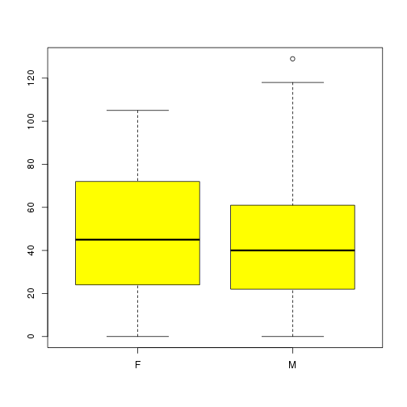
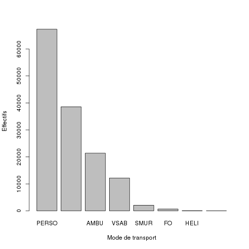

Analyse des RPU 2012 (version linux)
========================================================

Ce document exploite le fichier RData préparé à partir de la table RPU__ de Sagec. Voir le document *RPU2012_Prepa.Rmd* du sossier Resural.

Pour que les légendes de l'axe des Y soient perpendiculaires a ce dernier, rajouter *las = 1*
Pour que les légendes de l'axe des X soient perpendiculaires a ce dernier, rajouter *las = 2*
Pour que les légendes soient perpendiculaires aux 2 axes, rajouter *las = 3*
Par défaut *las = 0*

L'utilisation de la méthode *SweaveInput* provoque un erreur si le fichier à inclure comporte des caractères accenués (même enregistrés en UTF8)

Création d'un tableau avec *cbind* et une matrice (et xtable pour pdf): voir exhaustivité des données

Initialisation
==============
Définir le working directory:

```r
setwd("~/Documents/Resural/Stat Resural/RPU_2012")
```

Mise à jour:

```r
date()
```

```
## [1] "Wed May  1 19:58:15 2013"
```

```r
# A NE FAIRE QU'UNE FOIS AU DEBUT DE LA SESSION: loadhistory(file =
# '.Rhistory') timestamp() A FAIRE SI ON CHANGE DE WORKING DIRECTORY
# sauvegarde: savehistory(file = '.Rhistory')
```

Packages nécessaires
--------------------
gdata est utile pour la méthode drop.levels() qui supprime les levels inutiles:
(ref: http://rwiki.sciviews.org/doku.php?id=tips:data-manip:drop_unused_levels)

note: pour supprimer les messages inutiles *{r message=FALSE}*

note: pour supprimer les warnings: *{r warning=FALSE}*

```r
library("gdata")
library("rgrs")
library("lubridate")
```


Lecture du fichier des données
---------------------------------------
On lit le fichier de travail créé:

```r
load("rpu2012.Rda")
```

detach(d1)
attach(d1)

Chargement des routines perso
-----------------------------

```r
source("mes_fonctions.R")
```


Analyse des données
===================

```r
n <- dim(d1)
print(n)
```

```
## [1] 142376     20
```

```r
print(names(d1))
```

```
##  [1] "id"            "CODE_POSTAL"   "COMMUNE"       "DESTINATION"  
##  [5] "DP"            "ENTREE"        "EXTRACT"       "FINESS"       
##  [9] "GRAVITE"       "MODE_ENTREE"   "MODE_SORTIE"   "MOTIF"        
## [13] "NAISSANCE"     "ORIENTATION"   "PROVENANCE"    "SEXE"         
## [17] "SORTIE"        "TRANSPORT"     "TRANSPORT_PEC" "AGE"
```

```r
str(d1)
```

```
## 'data.frame':	142376 obs. of  20 variables:
##  $ id           : Factor w/ 150493 levels "2c9d838436119ed90136119ee0280001",..: 1 2 3 4 5 6 7 8 9 10 ...
##  $ CODE_POSTAL  : Factor w/ 2216 levels "0","109","110",..: 1379 1276 1276 1250 1259 1229 1229 1306 1305 1311 ...
##  $ COMMUNE      : Factor w/ 4377 levels "0","000000","00000000",..: 1260 3895 3895 4370 1464 3895 3895 2283 4043 2046 ...
##  $ DESTINATION  : Factor w/ 7 levels "NA","MCO","SSR",..: NA NA NA NA NA NA NA 2 2 NA ...
##  $ DP           : Factor w/ 5973 levels "A020","A029",..: 3742 3742 3742 3742 3742 3742 3742 3742 3742 3742 ...
##  $ ENTREE       : Factor w/ 126394 levels "2011-12-24 00:15:00",..: 10509 10463 10493 9287 9606 9607 10397 9567 9377 10049 ...
##  $ EXTRACT      : Factor w/ 1533 levels "2012-01-01 06:03:51",..: 65 65 65 65 65 65 65 65 65 65 ...
##  $ FINESS       : Factor w/ 9 levels "Wis","Sel","Odi",..: 4 4 4 4 4 4 4 4 4 4 ...
##  $ GRAVITE      : Factor w/ 8 levels "1","2","3","4",..: 7 7 7 7 7 7 7 7 7 7 ...
##  $ MODE_ENTREE  : Factor w/ 4 levels "NA","Mutation",..: 4 4 4 4 4 4 4 4 4 4 ...
##  $ MODE_SORTIE  : Factor w/ 5 levels "NA","Mutation",..: 4 4 4 4 4 4 4 2 2 4 ...
##  $ MOTIF        : Factor w/ 22220 levels "0 ; une agression",..: 5539 5539 5539 5539 5539 5539 5539 5539 5539 5539 ...
##  $ NAISSANCE    : Date, format: "1990-01-29" "1989-10-11" ...
##  $ ORIENTATION  : Factor w/ 52 levels "2012-05-18 22:31:00",..: 43 43 43 43 43 43 43 52 52 43 ...
##  $ PROVENANCE   : Factor w/ 7 levels "NA","MCO","SSR",..: NA NA NA NA NA NA NA NA NA NA ...
##  $ SEXE         : Factor w/ 7 levels "","AUCUN","F",..: 3 3 3 3 5 3 3 5 5 3 ...
##  $ SORTIE       : Factor w/ 108919 levels "","2011-12-24 01:21:00",..: 9281 9256 9271 8241 8511 8512 9222 8322 8161 8908 ...
##  $ TRANSPORT    : Factor w/ 8 levels "","AMBU","FO",..: 6 5 6 5 6 6 6 5 5 5 ...
##  $ TRANSPORT_PEC: Factor w/ 5 levels "","AUCUN","MED",..: 2 2 2 2 2 2 2 2 2 2 ...
##  $ AGE          : num  22 22 40 39 46 52 24 52 59 47 ...
```

```r
summary(d1)
```

```
##                                 id          CODE_POSTAL   
##  2c9d838436119ed90136119ee0280001:     1   68000  :16103  
##  2c9d838436119ed90136119ee0510002:     1   67100  : 9616  
##  2c9d838436119ed90136119ee05b0003:     1   67000  : 8453  
##  2c9d838436119ed90136119ee0790004:     1   67600  : 8045  
##  2c9d838436119ed90136119ee0860005:     1   67200  : 6100  
##  2c9d838436119ed90136119ee08d0006:     1   68500  : 3407  
##  (Other)                         :142370   (Other):90652  
##          COMMUNE       DESTINATION           DP        
##  STRASBOURG  :24151   MCO    : 38365   NULL   : 33827  
##  COLMAR      :16089   PSY    :   745   S934   :  2032  
##  SELESTAT    : 5329   SSR    :    22   R104   :  1428  
##  SAINT LOUIS : 2487   SLD    :     9   R53+1  :  1210  
##  SCHILTIGHEIM: 2248   HMS    :     3   S610   :  1030  
##  GUEBWILLER  : 2005   (Other):     1   N23    :  1007  
##  (Other)     :90067   NA's   :103231   (Other):101842  
##                  ENTREE                      EXTRACT           FINESS     
##  2012-11-20 13:54:00:     6   2012-04-09 06:06:57:  1083   Col    :46927  
##  2012-04-25 16:37:00:     5   2012-05-04 06:04:55:  1081   Hus    :35889  
##  2012-04-28 15:49:00:     5   2012-04-24 06:02:32:  1061   Sel    :26339  
##  2012-06-16 15:12:00:     5   2012-01-29 06:09:59:   988   Odi    :12354  
##  2012-06-22 19:09:00:     5   2012-05-15 06:05:02:   862   Wis    : 7711  
##  2012-07-14 21:10:00:     5   2012-01-08 06:05:28:   860   3Fr    : 7342  
##  (Other)            :142345   (Other)            :136441   (Other): 5814  
##     GRAVITE         MODE_ENTREE        MODE_SORTIE           MOTIF      
##  2      :82785   NA       :     0   NA       :    0   NULL      :48492  
##  NULL   :21242   Mutation :  2515   Mutation :37797   TRAUMATO17: 6949  
##  1      :21081   Transfert:  2035   Transfert: 1386   T139      : 2972  
##  3      :13925   Domicile :132743   Domicile :81724   GASTRO04  : 2188  
##  4      : 1619   NA's     :  5083   Décès    :    1   TRAUMATO09: 2164  
##  P      : 1325                      NA's     :21468   T119      : 2084  
##  (Other):  399                                        (Other)   :77527  
##    NAISSANCE           ORIENTATION       PROVENANCE       SEXE      
##  Min.   :1883-04-29   NULL   :101576   PEA    :90248        :   31  
##  1st Qu.:1946-12-31   UHCD   : 24605   MCO    : 4504   AUCUN:    3  
##  Median :1970-01-21   MED    :  8162   PEO    :  895   F    :68089  
##  Mean   :1967-12-06   CHIR   :  4017   SSR    :   26   I    :    1  
##  3rd Qu.:1989-04-20   REO    :  1332   PSY    :   22   M    :74250  
##  Max.   :2012-12-21   PSA    :   948   (Other):   15   NULL :    1  
##  NA's   :36           (Other):  1736   NA's   :46666   PERSO:    1  
##                  SORTIE         TRANSPORT     TRANSPORT_PEC  
##  NULL               : 13755   PERSO  :67336          :   36  
##                     :    35   NULL   :38574   AUCUN  :90600  
##  2012-04-30 20:59:00:    12   AMBU   :21393   MED    : 4777  
##  2012-12-07 20:00:00:    11   VSAB   :12179   NULL   :42649  
##  2012-04-29 20:24:00:     8   SMUR   : 2095   PARAMED: 4314  
##  2012-05-01 00:46:00:     8   FO     :  693                  
##  (Other)            :128547   (Other):  106                  
##       AGE       
##  Min.   :  0.0  
##  1st Qu.: 23.0  
##  Median : 42.0  
##  Mean   : 44.2  
##  3rd Qu.: 65.0  
##  Max.   :129.0  
##  NA's   :36
```

Stuctures hospitalières participantes
=====================================

```r
summary(d1$FINESS)
```

```
##   Wis   Sel   Odi   Hus   Hag   3Fr   Alk   Col   Geb 
##  7711 26339 12354 35889   725  7342   169 46927  4920
```

```r
a <- table(d1$FINESS)
round(prop.table(a) * 100, digits = 2)
```

```
## 
##   Wis   Sel   Odi   Hus   Hag   3Fr   Alk   Col   Geb 
##  5.42 18.50  8.68 25.21  0.51  5.16  0.12 32.96  3.46
```

### Origine temporelle des données:

```r
b <- tapply(as.Date(d1$ENTREE), d1$FINESS, min)
c <- as.Date(b, origin = "1970-01-01")
cbind(as.character(sort(c)))
```

```
##     [,1]        
## Col "2012-01-01"
## Hus "2012-02-10"
## Sel "2012-02-17"
## Wis "2012-04-23"
## Hag "2012-06-18"
## Odi "2012-06-30"
## 3Fr "2012-07-09"
## Geb "2012-09-01"
## Alk "2012-11-27"
```


Exhaustivité des données
------------------------
Il faut tranformer les valeurs NULL en NA pour pouvoir les comptabiliser. Les valeurs NULL apparaissent pour les factors: DP, MOTIF, TRANSPORT, ORIENTATION,GRAVITE, SORTIE. Il faut les transformer en charecter pour leur attriber la valeur NA au lieu de NULL:

```r
a <- as.character(d1$DP)
a[a == "NULL"] <- NA
sum(is.na(a))
```

```
## [1] 33827
```

```r
mean(is.na(a))
```

```
## [1] 0.2376
```

sum(is.na(a)) retourne le nombre de lignes concernées et *mean(is.na(a))* donne directement le pourcentage de valeurs nulles (R in action pp 356)

```r
d1$DP <- a

a <- as.character(d1$MOTIF)
a[a == "NULL"] <- NA
d1$MOTIF <- a

a <- as.character(d1$TRANSPORT)
a[a == "NULL"] <- NA
d1$TRANSPORT <- a

a <- as.character(d1$ORIENTATION)
a[a == "NULL"] <- NA
d1$ORIENTATION <- a

a <- as.character(d1$GRAVITE)
a[a == "NULL"] <- NA
d1$GRAVITE <- a

a <- as.character(d1$SORTIE)
a[a == "NULL"] <- NA
d1$SORTIE <- a

a <- as.character(d1$ENTREE)
a[a == "NULL"] <- NA
d1$ENTREE <- a
```


```r
a <- is.na(d1)
b <- apply(a, 2, mean)
a <- cbind(sort(round(b * 100, 2)))
colnames(a) <- "%"
a
```

```
##                   %
## id             0.00
## CODE_POSTAL    0.00
## COMMUNE        0.00
## ENTREE         0.00
## EXTRACT        0.00
## FINESS         0.00
## SEXE           0.00
## TRANSPORT_PEC  0.00
## NAISSANCE      0.03
## AGE            0.03
## MODE_ENTREE    3.57
## SORTIE         9.66
## GRAVITE       14.92
## MODE_SORTIE   15.08
## DP            23.76
## TRANSPORT     27.09
## PROVENANCE    32.78
## MOTIF         34.06
## ORIENTATION   71.34
## DESTINATION   72.51
```

# xtable(a)

orientation -> données erronées


Analyse univariée
=================
Sexe
----

```r
print(summary(d1$SEXE))
```

```
##       AUCUN     F     I     M  NULL PERSO 
##    31     3 68089     1 74250     1     1
```

Dossiers où la variable SEXE a une valeur aberrante:

```r
a <- d1[d1$SEXE != "F" & d1$SEXE != "M", ]
nrow(a)
```

```
## [1] 37
```

Finess concernés:

```r
a[, "FINESS"]
```

```
##  [1] Col Col Col Col Col Col Col Col Col Col Col Col Col Col Col Col Col
## [18] Col Col Col Col Col Col Col Col Col Col Col Sel Col Col Col Col Col
## [35] Col Col Col
## Levels: Wis Sel Odi Hus Hag 3Fr Alk Col Geb
```

Note: toutes les valeurs qui ne sont ni F ou M sont transformées en NA. Puis on applique une astuce qui consiste à réappliquer *factor* au vecteur (nb: d1$SEXE est du type factor). On peut aussi utiliser *drop.levels()* from the gdata package. Source: http://www.r-bloggers.com/r-drop-factor-levels-in-a-dataset

```r
a <- d1$SEXE
summary(a)
```

```
##       AUCUN     F     I     M  NULL PERSO 
##    31     3 68089     1 74250     1     1
```

```r
a[a != "F" & a != "M"] <- NA
a <- factor(a)
summary(a)
```

```
##     F     M  NA's 
## 68089 74250    37
```

```r
boxplot(d1$AGE ~ a, col = "yellow")
```

 

```r
d1$SEXE <- a
```


sexratio:

```r
t <- table(d1$SEXE)
print(paste(round(t["M"]/t["F"], digits = 2), "%"))
```

```
## [1] "1.09 %"
```

Age
---

```r
summary(d1$AGE)
```

```
##    Min. 1st Qu.  Median    Mean 3rd Qu.    Max.    NA's 
##     0.0    23.0    42.0    44.2    65.0   129.0      36
```

```r

age0 <- length(d1[d1$AGE < 1, "AGE"])
age75 <- length(d1[d1$AGE > 75, "AGE"])
age1_75 <- length(d1[d1$AGE > 0 & d1$AGE < 76, "AGE"])
effectif <- c(age0, age1_75, age75)
pourcentage <- round(pop * 100/sum(pop), 2)
```

```
## Error: objet 'pop' introuvable
```

```r
t <- data.frame(effectif, pourcentage, row.names = c("moins de 1 an", "de 1 à 75 ans", 
    "plus de 75 ans"))
```

```
## Error: objet 'pourcentage' introuvable
```

Gravité
-------

```r
table(d1$GRAVITE, useNA = "ifany")
```

```
## 
##     1     2     3     4     5     D     P  <NA> 
## 21081 82785 13925  1619   390     9  1325 21242
```

```r
freq(d1$GRAVITE)
```

```
##        n    %
## 1  21081 14.8
## 2  82785 58.1
## 3  13925  9.8
## 4   1619  1.1
## 5    390  0.3
## D      9  0.0
## P   1325  0.9
## NA 21242 14.9
```

```r
plot(table(d1$GRAVITE, useNA = "ifany"), xlab = "Gravité (CCMU)", ylab = "Effectifs", 
    main = "CCMU")
```

 

### gravité et sexe
en valeur absolue:

```r
t <- table(d1$GRAVITE, d1$SEXE)
round(prop.table(t) * 100, 3)
```

```
##    
##          F      M
##   1  8.119  9.274
##   2 32.579 35.773
##   3  5.639  5.857
##   4  0.661  0.675
##   5  0.135  0.187
##   D  0.002  0.006
##   P  0.576  0.516
```

en pourcentage:

```r
addmargins(t)
```

```
##      
##            F      M    Sum
##   1     9832  11230  21062
##   2    39452  43320  82772
##   3     6829   7093  13922
##   4      801    818   1619
##   5      163    227    390
##   D        2      7      9
##   P      698    625   1323
##   Sum  57777  63320 121097
```

```r
round(addmargins(prop.table(t) * 100), 3)
```

```
##      
##             F       M     Sum
##   1     8.119   9.274  17.393
##   2    32.579  35.773  68.352
##   3     5.639   5.857  11.497
##   4     0.661   0.675   1.337
##   5     0.135   0.187   0.322
##   D     0.002   0.006   0.007
##   P     0.576   0.516   1.093
##   Sum  47.711  52.289 100.000
```


### gravité et age
Moyenne et ecart-type:

```r
round(tapply(d1$AGE, d1$GRAVITE, mean, na.rm = TRUE), 2)
```

```
##     1     2     3     4     5     D     P 
## 36.77 41.07 56.48 66.94 63.62 69.33 41.93
```

```r
round(tapply(d1$AGE, d1$GRAVITE, sd, na.rm = TRUE), 2)
```

```
##     1     2     3     4     5     D     P 
## 24.69 25.18 27.16 21.70 19.99 25.94 16.72
```

```r
boxplot(d1$AGE ~ d1$GRAVITE, xlab = "Gravité (CCMU)", ylab = "Age (années)", 
    main = "CCMU et Age", col = "green")
```

 


### gravité et Finess

```r
t <- table(d1$FINESS, d1$GRAVITE)
t
```

```
##      
##           1     2     3     4     5     D     P
##   Wis   644  6619   345    59    22     1    15
##   Sel  2762 17781  4414   556    55     1   147
##   Odi   668 11503   110     3     1     1     1
##   Hus  2848  8676  3517   621   108     0     1
##   Hag   103   461    88     8     4     0     0
##   3Fr   905  6212    74     0     1     0     1
##   Alk    22   107    12     5     2     0     0
##   Col 12947 26727  5355   363   197     4  1147
##   Geb   182  4699    10     4     0     2    13
```

```r
a <- round(prop.table(t) * 100, 3)
a
```

```
##      
##            1      2      3      4      5      D      P
##   Wis  0.532  5.464  0.285  0.049  0.018  0.001  0.012
##   Sel  2.280 14.679  3.644  0.459  0.045  0.001  0.121
##   Odi  0.551  9.496  0.091  0.002  0.001  0.001  0.001
##   Hus  2.351  7.162  2.903  0.513  0.089  0.000  0.001
##   Hag  0.085  0.381  0.073  0.007  0.003  0.000  0.000
##   3Fr  0.747  5.128  0.061  0.000  0.001  0.000  0.001
##   Alk  0.018  0.088  0.010  0.004  0.002  0.000  0.000
##   Col 10.688 22.064  4.421  0.300  0.163  0.003  0.947
##   Geb  0.150  3.879  0.008  0.003  0.000  0.002  0.011
```

```r
barplot(a[, 1], main = "Pourcentage de CCMU 1 selon le SU", xlab = "Service d'urgence", 
    ylab = "CCMU 1 (en % de l'ensemble des CCMU)")
```

 

```r
barplot(a[, 2], main = "Pourcentage de CCMU 2 selon le SU", xlab = "Service d'urgence", 
    ylab = "CCMU 2 (en % de l'ensemble des CCMU)")
```

 

```r
barplot(a[, 3], main = "Pourcentage de CCMU 3 selon le SU", xlab = "Service d'urgence", 
    ylab = "CCMU 3 (en % de l'ensemble des CCMU)")
```

 

```r
barplot(a[, 4], main = "Pourcentage de CCMU 4 selon le SU", xlab = "Service d'urgence", 
    ylab = "CCMU 4 (en % de l'ensemble des CCMU)")
```

 

```r
barplot(a[, 5], main = "Pourcentage de CCMU 5 selon le SU", xlab = "Service d'urgence", 
    ylab = "CCMU 5 (en % de l'ensemble des CCMU)")
```

 

```r
barplot(a[, 6], main = "Pourcentage de CCMU D selon le SU", xlab = "Service d'urgence", 
    ylab = "CCMU D (en % de l'ensemble des CCMU)")
```

 

```r
barplot(a[, 7], main = "Pourcentage de CCMU P selon le SU", xlab = "Service d'urgence", 
    ylab = "CCMU P (en % de l'ensemble des CCMU)")
```

 

```r
round(addmargins(prop.table(t) * 100), 3)
```

```
##      
##             1       2       3       4       5       D       P     Sum
##   Wis   0.532   5.464   0.285   0.049   0.018   0.001   0.012   6.361
##   Sel   2.280  14.679   3.644   0.459   0.045   0.001   0.121  21.229
##   Odi   0.551   9.496   0.091   0.002   0.001   0.001   0.001  10.143
##   Hus   2.351   7.162   2.903   0.513   0.089   0.000   0.001  13.019
##   Hag   0.085   0.381   0.073   0.007   0.003   0.000   0.000   0.548
##   3Fr   0.747   5.128   0.061   0.000   0.001   0.000   0.001   5.938
##   Alk   0.018   0.088   0.010   0.004   0.002   0.000   0.000   0.122
##   Col  10.688  22.064   4.421   0.300   0.163   0.003   0.947  38.585
##   Geb   0.150   3.879   0.008   0.003   0.000   0.002   0.011   4.053
##   Sum  17.403  68.342  11.496   1.337   0.322   0.007   1.094 100.000
```


Destination
-----------

```r
table(d1$DESTINATION, useNA = "ifany")
```

```
## 
##     NA    MCO    SSR    SLD    PSY    HAD    HMS   <NA> 
##      0  38365     22      9    745      1      3 103231
```

```r
freq(d1$DESTINATION)
```

```
##          n    %
## MCO  38365 26.9
## SSR     22  0.0
## SLD      9  0.0
## PSY    745  0.5
## HAD      1  0.0
## HMS      3  0.0
## NA  103231 72.5
```

```r
plot(table(d1$DESTINATION, useNA = "ifany"), xlab = "Services", ylab = "Effectifs", 
    main = "Orientation des patients")
```

 

FINESS
------

```r
t <- table(d1$FINESS, useNA = "ifany")
t
```

```
## 
##   Wis   Sel   Odi   Hus   Hag   3Fr   Alk   Col   Geb 
##  7711 26339 12354 35889   725  7342   169 46927  4920
```

```r
round(prop.table(t) * 100, 2)
```

```
## 
##   Wis   Sel   Odi   Hus   Hag   3Fr   Alk   Col   Geb 
##  5.42 18.50  8.68 25.21  0.51  5.16  0.12 32.96  3.46
```

```r
freq(d1$FINESS)
```

```
##         n    %
## Wis  7711  5.4
## Sel 26339 18.5
## Odi 12354  8.7
## Hus 35889 25.2
## Hag   725  0.5
## 3Fr  7342  5.2
## Alk   169  0.1
## Col 46927 33.0
## Geb  4920  3.5
## NA      0  0.0
```

```r
plot(table(d1$FINESS, useNA = "ifany"), xlab = "Etablissements", ylab = "Effectifs", 
    main = "Etablissements sièges de SU")
```

 

Mode d'entrée
-------------

```r
table(d1$MODE_ENTREE, useNA = "ifany")
```

```
## 
##        NA  Mutation Transfert  Domicile      <NA> 
##         0      2515      2035    132743      5083
```

```r
freq(d1$MODE_ENTREE)
```

```
##                n    %
## Mutation    2515  1.8
## Transfert   2035  1.4
## Domicile  132743 93.2
## NA          5083  3.6
```

```r
plot(table(d1$MODE_ENTREE, useNA = "ifany"), xlab = "Mode d'entée", ylab = "Effectifs", 
    main = "")
```

 

Mode de sortie
--------------

```r
table(d1$MODE_SORTIE, useNA = "ifany")
```

```
## 
##        NA  Mutation Transfert  Domicile     Décès      <NA> 
##         0     37797      1386     81724         1     21468
```

```r
freq(d1$MODE_SORTIE)
```

```
##               n    %
## Mutation  37797 26.5
## Transfert  1386  1.0
## Domicile  81724 57.4
## Décès         1  0.0
## NA        21468 15.1
```

```r
plot(table(d1$MODE_SORTIE, useNA = "ifany"), xlab = "Mode de sortie", ylab = "Effectifs", 
    main = "")
```

 

Orientation
-----------
La rubrique *ORIENTATION* comprte un certain nombre d'éléments aberrants qui perturbent son interprétation comme facteur. Dans un premier temps, on ne retient que les valeurs comportant moins de dix caractères, puis on transforme la rubrique en facteur:

```r
b <- d1$ORIENTATION[nchar(d1$ORIENTATION) < 10]
d1$ORIENTATION <- as.factor(b)
```

```
## Error: replacement has 142344 rows, data has 142376
```

Il reste encore quelques intitulés anormaux: M, F, REO?

On suppose également que les NA correspondent aux patients non hospitalisés. On crée un dataframe des patients hospitalisés après leur passage aux urgences

```r
a <- b[!is.na(b)]
```

nombre de patients hospitalisés:

```r
length(a)
```

```
## [1] 40768
```

Taux d'hospitalisation:

```r
round(length(a) * 100/nrow(d1), 2)
```

```
## [1] 28.63
```


Transformation en facteur et analyse:

```r
hospit <- factor(a)
hospit[hospit == "M" | a == "F"] <- NA  # on supprime M et F
summary(hospit)
```

```
##  CHIR     F FUGUE   HDT    HO     M   MED  OBST   PSA   REA   REO    SC 
##  4017     0   133    88    12     0  8162    26   948   431  1332   212 
##  SCAM    SI  UHCD  NA's 
##   215   583 24605     4
```

```r
f <- freq(hospit, sort = "inc", digits = 2)
f
```

```
##           n     %
## NA        4  0.01
## HO       12  0.03
## OBST     26  0.06
## HDT      88  0.22
## FUGUE   133  0.33
## SC      212  0.52
## SCAM    215  0.53
## REA     431  1.06
## SI      583  1.43
## PSA     948  2.33
## REO    1332  3.27
## CHIR   4017  9.85
## MED    8162 20.02
## UHCD  24605 60.35
```

```r
t <- table(hospit)
sort(t)
```

```
## hospit
##     F     M    HO  OBST   HDT FUGUE    SC  SCAM   REA    SI   PSA   REO 
##     0     0    12    26    88   133   212   215   431   583   948  1332 
##  CHIR   MED  UHCD 
##  4017  8162 24605
```

```r
barplot(sort(t, decreasing = TRUE), main = "Orientation des patients hospitalisés")
```

 

TODO:

- créer une colonne supplémentaire dans D1 pour marquer ceux qui sont hospitalisé de ceux qui ne le sont pas
- caractéristiques (age, sexe, CCMU) des hospitalisés versus les non hospialisés
- y a t'il des hopitaux qui hospitalisent plus que d'autres ?

Provenance
----------

```r
table(d1$PROVENANCE, useNA = "ifany")
```

```
## 
##    NA   MCO   SSR   SLD   PSY   PEA   PEO  <NA> 
##     0  4504    26    15    22 90248   895 46666
```

```r
freq(d1$PROVENANCE)
```

```
##         n    %
## MCO  4504  3.2
## SSR    26  0.0
## SLD    15  0.0
## PSY    22  0.0
## PEA 90248 63.4
## PEO   895  0.6
## NA  46666 32.8
```

```r
barplot(sort(table(d1$PROVENANCE, useNA = "ifany"), decreasing = TRUE), xlab = "Provenance", 
    ylab = "Effectifs", main = "")
```

 

Transport
---------

```r
table(d1$TRANSPORT, useNA = "ifany")
```

```
## 
##        AMBU    FO  HELI PERSO  SMUR  VSAB  <NA> 
##    36 21393   693    70 67336  2095 12179 38574
```

```r
freq(d1$TRANSPORT)
```

```
##           n    %
##          36  0.0
## AMBU  21393 15.0
## FO      693  0.5
## HELI     70  0.0
## PERSO 67336 47.3
## SMUR   2095  1.5
## VSAB  12179  8.6
## NA    38574 27.1
```

```r
barplot(sort(table(d1$TRANSPORT, useNA = "ifany"), decreasing = TRUE), xlab = "Mode de transport", 
    ylab = "Effectifs", main = "")
```

 

Prise en charge
---------------
Note: *freq* nécessite *rgrs*. Réalise le tri à plat d'une variable. Permet aussi d'afficher le % cumulé, d'exclure certaines variables du tri, d'afficher l'effectif total et de préciser le nombre de chiffres significatifs.

```r
table(d1$TRANSPORT_PEC, useNA = "ifany")
```

```
## 
##           AUCUN     MED    NULL PARAMED 
##      36   90600    4777   42649    4314
```

```r
f <- freq(d1$TRANSPORT_PEC, sort = "inc", exclude = c(NA, ""), total = TRUE)
f
```

```
##              n     %
## PARAMED   4314   3.0
## MED       4777   3.4
## NULL     42649  30.0
## AUCUN    90600  63.7
## Total   142340 100.0
```

```r
barplot(f[1:nrow(f) - 1, 1])
```

 

```r
row.names(f)
```

```
## [1] "PARAMED" "MED"     "NULL"    "AUCUN"   "Total"
```

```r
barplot(f[1:nrow(f), 1], names.arg = row.names(f))
```

 

```r

t <- table(d1$TRANSPORT_PEC)
barplot(sort(t, decreasing = TRUE), xlab = "Prise en charge pendant le transport", 
    ylab = "Effectifs", main = "")
```

 


Analyse bivariée
================

### Age et sexe

```r
boxplot(d1$AGE ~ d1$SEXE, ylab = "Age (années)", xlab = "Sexe", las = 2)
```

 

Age et Gravité
--------------

```r
boxplot(d1$AGE ~ d1$GRAVITE, xlab = "Gravité exprimée en échelle CCMU", ylab = "Age (années)", 
    main = "Age et Gravité")
```

 

Age et FINESS
-------------
Les HUS ont une patientèle plus agée que la moyenne:       

```r
boxplot(d1$AGE ~ d1$FINESS, xlab = "Etablissement", ylab = "Age (années)")
```

 

```r
round(tapply(d1$AGE, d1$FINESS, mean, na.rm = TRUE), 2)
```

```
##   Wis   Sel   Odi   Hus   Hag   3Fr   Alk   Col   Geb 
## 42.58 37.70 34.04 56.48 44.36 39.00 33.41 43.09 36.46
```

Pour rendre le graphique plus parlant, on réorganise les boxplots pour qu'ils soient affichés par moyenne d'age croissante. D'abord on réorganise les FINESS avec la fonction *reorder* qui demande trois paramètres: le variable factor à reorganiser (finess), la variable qui servira de supoort à la réorganisation (age) et la fonction de tri (mean). S'agissant de la moyenne ne pas oublier na.rm=TRUE pour éviter un affichage aberrant. Puis on affiche les boxplots par ordre de moyenne d'age croissant. 

```r
a <- with(d1, reorder(FINESS, AGE, mean, na.rm = TRUE))
boxplot(AGE ~ a, data = d1, xlab = "Etablissement", ylab = "Age (années)", 
    col = "orange")
```

 


Age et établissement
--------------------

```r
boxplot(d1$AGE ~ d1$FINESS, ylab = "Age (années)", xlab = "Etablissement", 
    main = "Age des patients selon l'établissement")
```

 

FINESS
======
### FINESS et GRAVITE

```r
plot(d1$FINESS ~ d1$GRAVITE, ylab = "Etablissement", xlab = "Gravité (CCMU)")
```

```
## Warning: NAs introduits lors de la conversion automatique
```

```
## Error: les longueurs de 'at' et de 'labels' diffèrent, 21 != 53454
```

 

```r
a <- table(d1$FINESS, d1$GRAVITE)
addmargins(a)
```

```
##      
##            1      2      3      4      5      D      P    Sum
##   Wis    644   6619    345     59     22      1     15   7705
##   Sel   2762  17781   4414    556     55      1    147  25716
##   Odi    668  11503    110      3      1      1      1  12287
##   Hus   2848   8676   3517    621    108      0      1  15771
##   Hag    103    461     88      8      4      0      0    664
##   3Fr    905   6212     74      0      1      0      1   7193
##   Alk     22    107     12      5      2      0      0    148
##   Col  12947  26727   5355    363    197      4   1147  46740
##   Geb    182   4699     10      4      0      2     13   4910
##   Sum  21081  82785  13925   1619    390      9   1325 121134
```

```r
round(prop.table(a) * 100, digit = 2)
```

```
##      
##           1     2     3     4     5     D     P
##   Wis  0.53  5.46  0.28  0.05  0.02  0.00  0.01
##   Sel  2.28 14.68  3.64  0.46  0.05  0.00  0.12
##   Odi  0.55  9.50  0.09  0.00  0.00  0.00  0.00
##   Hus  2.35  7.16  2.90  0.51  0.09  0.00  0.00
##   Hag  0.09  0.38  0.07  0.01  0.00  0.00  0.00
##   3Fr  0.75  5.13  0.06  0.00  0.00  0.00  0.00
##   Alk  0.02  0.09  0.01  0.00  0.00  0.00  0.00
##   Col 10.69 22.06  4.42  0.30  0.16  0.00  0.95
##   Geb  0.15  3.88  0.01  0.00  0.00  0.00  0.01
```

Gavité et établissement: les fréquences sont exprimées en pourcentage. La somme de chaque ligne est égale à 100%.

```r
addmargins(round(prop.table(a, margin = 1) * 100, digit = 2), margin = 2)
```

```
##      
##            1      2      3      4      5      D      P    Sum
##   Wis   8.36  85.91   4.48   0.77   0.29   0.01   0.19 100.01
##   Sel  10.74  69.14  17.16   2.16   0.21   0.00   0.57  99.98
##   Odi   5.44  93.62   0.90   0.02   0.01   0.01   0.01 100.01
##   Hus  18.06  55.01  22.30   3.94   0.68   0.00   0.01 100.00
##   Hag  15.51  69.43  13.25   1.20   0.60   0.00   0.00  99.99
##   3Fr  12.58  86.36   1.03   0.00   0.01   0.00   0.01  99.99
##   Alk  14.86  72.30   8.11   3.38   1.35   0.00   0.00 100.00
##   Col  27.70  57.18  11.46   0.78   0.42   0.01   2.45 100.00
##   Geb   3.71  95.70   0.20   0.08   0.00   0.04   0.26  99.99
```

Avec code de couleur:

```r
plot(d1$FINESS ~ d1$GRAVITE, ylab = "Etablissement", xlab = "Gravité (CCMU)", 
    col = terrain.colors(n = 9))
```

```
## Warning: NAs introduits lors de la conversion automatique
```

```
## Error: les longueurs de 'at' et de 'labels' diffèrent, 21 != 53454
```

 

Même calcul en supprimant Hag et Alk dont la contribution est négligeable:
(nécessite le package gdata)

```r
d2 <- d1[d1$FINESS != "Hag" & d1$FINESS != "Alk", c(8, 9)]
d2$FINESS <- drop.levels(d2$FINESS)
```

```
## Warning: NAs introduits lors de la conversion automatique
```

```
## Warning: NAs introduits lors de la conversion automatique
```

```
## Warning: NAs introduits lors de la conversion automatique
```

```
## Warning: NAs introduits lors de la conversion automatique
```

```
## Warning: NAs introduits lors de la conversion automatique
```

```
## Warning: NAs introduits lors de la conversion automatique
```

```
## Warning: NAs introduits lors de la conversion automatique
```

```
## Warning: NAs introduits lors de la conversion automatique
```

```
## Warning: NAs introduits lors de la conversion automatique
```

```
## Warning: NAs introduits lors de la conversion automatique
```

```
## Warning: NAs introduits lors de la conversion automatique
```

```
## Warning: NAs introduits lors de la conversion automatique
```

```
## Warning: NAs introduits lors de la conversion automatique
```

```
## Warning: NAs introduits lors de la conversion automatique
```

```r
summary(d2$FINESS)
```

```
##   3Fr   Col   Geb   Hus   Odi   Sel   Wis 
##  7342 46927  4920 35889 12354 26339  7711
```

```r
plot(d2$FINESS ~ d2$GRAVITE, ylab = "Etablissement", xlab = "Gravité (CCMU)", 
    col = terrain.colors(n = 7))
```

```
## Warning: NAs introduits lors de la conversion automatique
```

```
## Error: les longueurs de 'at' et de 'labels' diffèrent, 21 != 53153
```

 

